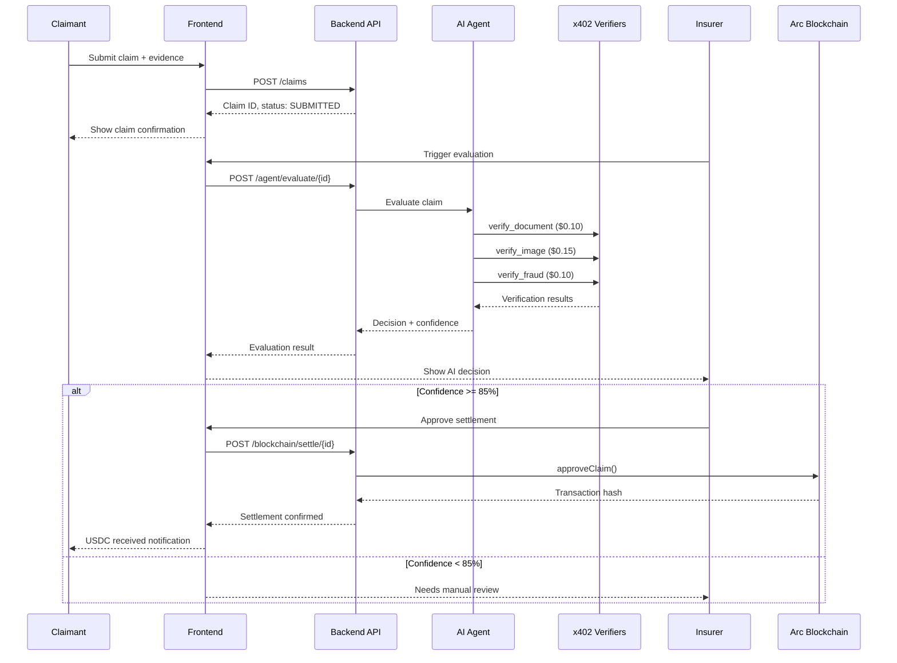

# ClaimLedger

Autonomous, Multimodal Insurance Claims with Deterministic USDC Settlement on Arc

## Overview

ClaimLedger is an agentic insurance settlement platform that combines AI-powered evaluation with blockchain-based settlements. The platform demonstrates the integration of:

- **Google Agents Framework** with Gemini for intelligent claim evaluation
- **x402 Protocol** with Circle Gateway for usage-based micropayments
- **Arc Blockchain** with native USDC for transparent settlements
- **Circle Wallets** for secure user wallet management

### Key Value Propositions

| Feature | Benefit |
|---------|---------|
| AI Agent Evaluation | Automated, consistent claim assessment with multimodal analysis |
| x402 Micropayments | Pay-per-use verification services ($0.35 per claim evaluation) |
| On-chain Settlement | Transparent, auditable USDC transfers on Arc blockchain |
| Fail-closed Logic | No funds move unless AI confidence >= 85% |

## Application Layer

### User Personas

**Claimant** - Insurance policyholder who submits claims
- Submits insurance claims with evidence files
- Tracks claim status in real-time
- Receives USDC settlements when claims are approved

**Insurer** - Insurance company representative
- Reviews AI agent decisions
- Views all submitted claims
- Triggers settlements for approved claims

### User Workflows

#### Claimant Journey

```
1. Registration → 2. Submit Claim → 3. Track Status → 4. Receive Settlement
```

1. **Registration**: User creates account with email/password. Circle Wallet is automatically created (or mock wallet in testnet mode)
2. **Submit Claim**: Fill claim form with amount and upload evidence files (documents, images)
3. **Track Status**: View real-time claim status progression (SUBMITTED → EVALUATING → APPROVED/NEEDS_REVIEW)
4. **Receive Settlement**: If approved, insurer settles claim and USDC is transferred to claimant's wallet on Arc

#### Insurer Journey

```
1. Login → 2. Review Claims → 3. Trigger Evaluation → 4. Approve/Settle
```

1. **Login**: Authenticate as insurer role
2. **Review Claims**: View all submitted claims with statistics dashboard
3. **Trigger Evaluation**: Initiate AI agent evaluation (costs $0.35 in x402 micropayments)
4. **Approve/Settle**: Review AI decision and confidence score, then trigger on-chain settlement

### Application Features

#### Landing Page
- Hero section with value proposition
- Key statistics ($0.35 per evaluation, < 30s processing, 92% AI confidence)
- Feature highlights (AI Agent, x402 Payments, USDC Settlement)
- Demo flow visualization
- Call-to-action buttons for Claimant and Insurer dashboards

#### Claimant Dashboard (`/claimant`)
- **Claim Submission Form**: 
  - Claim amount input
  - Evidence file upload (multiple files supported)
  - Real-time form validation
- **Claim Status Tracking**:
  - Current status display (SUBMITTED, EVALUATING, APPROVED, SETTLED)
  - Verification steps visualization (Document, Image, Fraud checks)
  - x402 payment breakdown ($0.10 + $0.15 + $0.10)
  - AI confidence score and reasoning
- **Wallet Integration**: 
  - Automatic wallet address display
  - Circle Wallets SDK integration
  - Balance checking

#### Insurer Dashboard (`/insurer`)
- **Statistics Overview**:
  - Total claims count
  - Awaiting settlement count
  - Settled claims count
  - Total settled amount (USDC)
- **Claims Management**:
  - Pending claims list with status badges
  - Settlement cards with claim details
  - One-click settlement trigger
  - Transaction hash links to Arc block explorer
- **Settlement Interface**:
  - Review AI evaluation results
  - View confidence scores and reasoning
  - Approve and trigger on-chain settlement
  - Track settlement transactions

### UI/UX Highlights

- **Modern Design System**: Glassmorphism effects, gradient backgrounds, dark theme
- **Responsive Layouts**: Mobile-first design, works on all screen sizes
- **Wallet Connection Flow**: Seamless Circle Wallets integration with automatic wallet creation
- **Evidence File Upload**: Drag-and-drop file upload with preview
- **x402 Payment Visualization**: Clear breakdown of micropayment costs per verification step
- **Transaction Links**: Direct links to Arc block explorer for transparency
- **Real-time Status Updates**: Live claim status progression without page refresh
- **Role-based Access**: Different views for Claimant vs Insurer roles

### Application Workflows

#### End-to-End Claim Lifecycle



#### Authentication Flow

1. User clicks "Login as Claimant" or "Login as Insurer"
2. AuthModal opens with registration/login form
3. On registration: Backend creates Circle Wallet (or mock wallet in testnet mode)
4. Wallet address automatically displayed in Navbar
5. User can immediately submit claims or view dashboard

#### Status Progression

- **SUBMITTED**: Claim created, awaiting evaluation
- **EVALUATING**: AI agent is processing (calling x402 verifiers)
- **APPROVED**: AI confidence >= 85%, ready for settlement
- **NEEDS_REVIEW**: AI confidence < 85%, requires manual review
- **SETTLED**: USDC transferred on Arc, transaction hash recorded

## Features

### Core Capabilities

- **AI Agent Evaluation**: Google Agents Framework with Gemini analyzes multimodal evidence (documents, images)
- **Multimodal Verification**: Three specialized verifiers (Document, Image, Fraud) with x402 micropayments
- **x402 Micropayments**: Pay-per-use verification services via Circle Gateway ($0.35 total per claim)
- **On-chain Settlement**: USDC transfers on Arc blockchain with transparent transaction history
- **Fail-closed Logic**: No funds move unless AI confidence >= 85%
- **Testnet Mode**: Full functionality without Circle credentials (uses mock wallets)

### Technical Features

- **Wallet-as-a-Service**: Circle Wallets SDK for seamless wallet management
- **JWT Authentication**: Secure token-based authentication
- **Role-based Access Control**: Separate views and permissions for Claimants and Insurers
- **Real-time Status Updates**: Live claim status tracking
- **File Upload**: Support for multiple evidence file types
- **Block Explorer Integration**: Direct links to Arc transactions

## Architecture

### High-Level Architecture

ClaimLedger follows a three-layer architecture:

```
┌─────────────────────────────────────────────────────────────┐
│                    Frontend Layer                           │
│              Next.js + TypeScript + Tailwind                │
│  Landing Page | Claimant Dashboard | Insurer Dashboard     │
└─────────────────────────────────────────────────────────────┘
                            ↕
┌─────────────────────────────────────────────────────────────┐
│                    Backend Layer                              │
│              FastAPI + Python + SQLAlchemy                   │
│  Claims API | Agent API | Verifier API | Blockchain API     │
└─────────────────────────────────────────────────────────────┘
                            ↕
┌─────────────────────────────────────────────────────────────┐
│                  Blockchain Layer                             │
│              Arc Testnet + ClaimEscrow Contract              │
│              USDC Token + Smart Contract Logic               │
└─────────────────────────────────────────────────────────────┘
```

### Key Components

- **One Contract**: `ClaimEscrow.sol` - Escrow and settlement logic
- **One Agent**: Google Agents Framework with 4 explicit tools
- **Three x402 Verifiers**: Document, Image, Fraud (Gateway micropayments)
- **One Settlement**: USDC transfer on Arc

For detailed architecture documentation, see [docs/HLD.md](docs/HLD.md).

## Tech Stack

### Backend

| Component | Technology | Version | Purpose |
|-----------|------------|---------|---------|
| Runtime | Python | 3.11+ | Primary language |
| Framework | FastAPI | 0.104+ | REST API framework |
| ORM | SQLAlchemy | 2.0+ | Database abstraction |
| Database | SQLite/PostgreSQL | - | Data persistence |
| AI SDK | google-genai | 0.2+ | Gemini API client |
| HTTP Client | httpx | 0.25+ | Async HTTP requests |
| Auth | python-jose | 3.3+ | JWT tokens |
| Package Manager | uv | Latest | Dependency management |

### Frontend

| Component | Technology | Version | Purpose |
|-----------|------------|---------|---------|
| Framework | Next.js | 14+ | React framework |
| Language | TypeScript | 5+ | Type safety |
| Styling | Tailwind CSS | 3+ | Utility-first CSS |
| Wallets | Circle Wallets SDK | 1.1+ | Wallet-as-a-service |
| State | React Query | 5+ | Server state management |

### Blockchain

| Component | Technology | Purpose |
|-----------|------------|---------|
| Language | Solidity 0.8.20 | Smart contract development |
| Toolkit | Foundry | Build, test, deploy |
| Network | Arc Testnet | Settlement layer |
| Token | USDC | Native gas + payments |

### External Services

- **Google Gemini API**: AI inference for claim evaluation
- **Circle Gateway**: x402 micropayments and unified balances
- **Circle Wallets**: Developer-controlled wallet management
- **Arc Blockchain**: EVM-compatible L1 for settlements

## Project Structure

```
claimledger/
├── backend/                 # FastAPI backend
│   ├── src/
│   │   ├── api/            # REST API endpoints
│   │   │   ├── claims.py   # Claim submission & retrieval
│   │   │   ├── agent.py    # AI agent evaluation
│   │   │   ├── verifier.py # x402 verification endpoints
│   │   │   ├── blockchain.py # Settlement triggers
│   │   │   └── auth.py     # Authentication endpoints
│   │   ├── agent/          # AI agent implementation
│   │   │   ├── agent.py    # ClaimEvaluationAgent
│   │   │   └── tools.py    # Agent tools (verify_*, approve_claim)
│   │   ├── services/       # Business logic services
│   │   │   ├── x402_client.py # x402 payment handler
│   │   │   ├── gateway.py  # Circle Gateway API client
│   │   │   ├── blockchain.py # Arc contract interactions
│   │   │   └── circle_wallets.py # Circle Wallets integration
│   │   ├── models.py       # Database models
│   │   └── main.py         # FastAPI app
│   └── pyproject.toml       # Python dependencies
│
├── frontend/                # Next.js frontend
│   ├── app/
│   │   ├── page.tsx        # Landing page
│   │   ├── claimant/       # Claimant dashboard
│   │   │   └── page.tsx
│   │   ├── insurer/        # Insurer dashboard
│   │   │   └── page.tsx
│   │   ├── components/    # React components
│   │   │   ├── ClaimForm.tsx
│   │   │   ├── ClaimStatus.tsx
│   │   │   ├── SettlementCard.tsx
│   │   │   ├── WalletConnect.tsx
│   │   │   └── ui/         # Base UI components
│   │   └── globals.css     # Design system
│   └── package.json        # Node dependencies
│
├── contracts/               # Solidity smart contracts
│   ├── src/
│   │   └── ClaimEscrow.sol # Escrow contract
│   ├── script/
│   │   └── Deploy.s.sol     # Deployment script
│   └── foundry.toml        # Foundry configuration
│
└── docs/                    # Documentation
    ├── HLD.md              # High-Level Design
    ├── LLD.md              # Low-Level Design
    ├── QUICK_START_TESTING.md
    ├── ENVIRONMENT_VARIABLES.md
    └── DEPLOYMENT_GUIDE.md
```

## Quick Start

### Prerequisites

- **Python 3.11+**: [Download](https://www.python.org/downloads/)
- **Node.js 18+**: [Download](https://nodejs.org/)
- **PostgreSQL** (optional): SQLite works for development
- **uv**: Python package manager - `curl -LsSf https://astral.sh/uv/install.sh | sh` or `pip install uv`
- **Foundry**: Solidity toolkit - `curl -L https://foundry.paradigm.xyz | bash && foundryup`

### Environment Setup

#### Backend

1. Create `backend/.env` file:
```bash
# Database
DATABASE_URL=sqlite:///./claimledger.db

# JWT Authentication
JWT_SECRET_KEY=your-secret-key-change-in-production

# Optional: Circle credentials (for real wallets)
# CIRCLE_WALLETS_API_KEY=your_api_key_here
# CIRCLE_ENTITY_SECRET=your_entity_secret_here
# CIRCLE_GATEWAY_API_KEY=your_gateway_api_key_here

# Google AI
GOOGLE_API_KEY=your_google_api_key_here

# Arc Blockchain
ARC_RPC_URL=https://rpc.testnet.arc.network
CLAIM_ESCROW_ADDRESS=0x80794995149E5d26F22c36eD56B817CBd8E5d4Fa
USDC_ADDRESS=0x3600000000000000000000000000000000
```

**Note**: You can test without Circle credentials! Mock wallets will be created automatically. See [docs/TESTNET_MODE.md](docs/TESTNET_MODE.md) for details.

2. Install dependencies:
```bash
cd backend
uv pip install -e ".[dev]"
```

3. Start backend server:
```bash
uv run uvicorn src.main:app --reload
```

Backend runs on `http://localhost:8000`

#### Frontend

1. Create `frontend/.env.local` file:
```bash
NEXT_PUBLIC_API_URL=http://localhost:8000
```

2. Install dependencies:
```bash
cd frontend
npm install
```

3. Start frontend dev server:
```bash
npm run dev
```

Frontend runs on `http://localhost:3000`

#### Contracts

1. Build contracts:
```bash
cd contracts
forge build
```

2. Run tests:
```bash
forge test
```

For detailed setup instructions, see [docs/ENVIRONMENT_VARIABLES.md](docs/ENVIRONMENT_VARIABLES.md).

## Development

### Development Workflow

- All features must include unit tests
- All changes via Pull Requests (never commit directly to `main`)
- CI runs tests on every push
- Main branch must always be demoable

### Branch Naming

- `feat/` - New features
- `fix/` - Bug fixes
- `docs/` - Documentation
- `test/` - Tests
- `refactor/` - Refactoring

### Commit Format

```
<type>(<scope>): <description>
```

Types: `feat`, `fix`, `docs`, `test`, `refactor`, `chore`, `ci`

### Running Tests

```bash
# Backend tests
cd backend
uv run pytest

# Contract tests
cd contracts
forge test
```

## Testing

### Quick Testing Guide

See [docs/QUICK_START_TESTING.md](docs/QUICK_START_TESTING.md) for comprehensive testing instructions.

### Test Scenarios

1. **User Registration**: Register as Claimant or Insurer
2. **Claim Submission**: Submit claim with evidence files
3. **AI Evaluation**: Trigger agent evaluation (costs $0.35)
4. **Settlement**: Approve and settle claim on Arc

### CI/CD

Tests run automatically on every push via GitHub Actions:
- Backend: Python tests with pytest
- Contracts: Solidity tests with Foundry

## Deployment

### Contract Deployment

To deploy `ClaimEscrow` contract to Arc testnet:

1. Set up environment variables (see [docs/DEPLOYMENT_GUIDE.md](docs/DEPLOYMENT_GUIDE.md))
2. Deploy using Foundry:
```bash
cd contracts
forge script script/Deploy.s.sol:DeployClaimEscrow \
  --rpc-url $ARC_RPC_URL \
  --private-key $PRIVATE_KEY \
  --broadcast
```

3. Save deployed address to `backend/.env` and `frontend/.env.local`

For detailed deployment instructions, see [docs/DEPLOYMENT_GUIDE.md](docs/DEPLOYMENT_GUIDE.md).

## API Reference

### Main Endpoints

#### Claims
- `POST /claims` - Submit new claim (requires authentication)
- `GET /claims` - List all claims (role-based filtering)
- `GET /claims/{id}` - Get claim details

#### Agent
- `POST /agent/evaluate/{claim_id}` - Trigger AI agent evaluation

#### Blockchain
- `POST /blockchain/settle/{claim_id}` - Trigger on-chain settlement

#### Authentication
- `POST /auth/register` - Register new user
- `POST /auth/login` - Login user
- `GET /auth/me` - Get current user info
- `GET /auth/wallet` - Get wallet information

For detailed API documentation, visit `http://localhost:8000/docs` when backend is running.

## Documentation

### Setup & Configuration
- [Environment Variables](docs/ENVIRONMENT_VARIABLES.md) - Complete environment setup guide
- [Testnet Mode](docs/TESTNET_MODE.md) - Testing without Circle credentials
- [Circle Entity Secret Setup](docs/CIRCLE_ENTITY_SECRET_SETUP.md) - Circle wallet configuration

### Testing
- [Quick Start Testing](docs/QUICK_START_TESTING.md) - 5-minute testing guide
- [Backend Auth Testing](docs/BACKEND_AUTH_TESTING.md) - Authentication testing
- [Circle Wallets Testing](docs/CIRCLE_WALLETS_TESTING.md) - Wallet integration testing

### Architecture
- [High-Level Design (HLD)](docs/HLD.md) - System architecture and design
- [Low-Level Design (LLD)](docs/LLD.md) - Detailed component design

### Deployment
- [Deployment Guide](docs/DEPLOYMENT_GUIDE.md) - Contract deployment to Arc testnet

### Additional Resources
- [Circle Wallets Integration Types](docs/CIRCLE_WALLETS_INTEGRATION_TYPES.md) - Wallet integration patterns
- [Testing Results](docs/TESTING_RESULTS.md) - Test execution results

## Contributing

1. Create a feature branch from `main`: `git checkout -b feat/your-feature`
2. Make your changes
3. Write/update tests
4. Ensure all tests pass
5. Commit using conventional commits: `feat(scope): description`
6. Push and create Pull Request

**Never commit directly to `main` branch.**

## Troubleshooting

### Common Issues

**"CIRCLE_ENTITY_SECRET not configured"**
- This is expected in testnet mode
- Mock wallets will be created automatically
- See [docs/TESTNET_MODE.md](docs/TESTNET_MODE.md)

**"Email already registered"**
- User already exists
- Try logging in instead
- Or use a different email

**Backend returns 500 error**
- Check backend logs for error details
- Verify database is initialized
- Ensure dependencies are installed: `uv pip install -e ".[dev]"`

**Frontend build fails**
- Check Node.js version: `node --version` (should be 18+)
- Remove `node_modules` and reinstall: `rm -rf node_modules && npm install`

**CORS errors**
- Backend CORS is configured for `http://localhost:3000`
- Verify backend is running on port 8000
- Verify frontend is running on port 3000

For more troubleshooting help, see [docs/QUICK_START_TESTING.md](docs/QUICK_START_TESTING.md).

## License

MIT
