# Step-by-Step: Deploy ClaimEscrow to Arc Testnet 🚀

## Quick Start (5 Minutes)

If you're ready to deploy quickly, follow these steps:

### Prerequisites
- ✅ Foundry installed (`forge --version`)
- ✅ Arc testnet USDC address: `0x3600000000000000000000000000000000000000`
- ✅ Deployer wallet with testnet USDC for gas
- ✅ Private key (keep it secret!)

### Quick Deploy Steps

```bash
# 1. Set up environment
cd contracts
source .env  # Make sure ARC_RPC_URL and PRIVATE_KEY are set

# 2. Build and test
forge build
forge test

# 3. Deploy to Arc testnet
forge script script/Deploy.s.sol:DeployClaimEscrow \
  --rpc-url $ARC_RPC_URL \
  --private-key $PRIVATE_KEY \
  --broadcast \
  --slow

# 4. Save deployed address
# Copy the address from output and add to:
# - backend/.env: CLAIM_ESCROW_ADDRESS=0x...
# - frontend/.env.local: NEXT_PUBLIC_CLAIM_ESCROW_CONTRACT_ADDRESS=0x...
```

**Expected Output:**
```
ClaimEscrow deployed at: 0x80794995149E5d26F22c36eD56B817CBd8E5d4Fa
USDC address: 0x3600000000000000000000000000000000000000
```

**Verify on Block Explorer:** https://testnet.arcscan.app

---

## High-Level Architecture: What We've Built

### Deployment Architecture Overview


### Escrow Mechanism Explained

**What is Escrow?** Think of it like a safety deposit box:
- Money (USDC) is locked in a secure place (the smart contract)
- It can't be moved until certain conditions are met
- Only authorized parties can release the funds

```mermaid
sequenceDiagram
    participant Claimant as 👤 Claimant<br/>(User)
    participant Backend as 🔧 Backend API
    participant Escrow as 🔒 ClaimEscrow<br/>Contract
    participant USDC as 💵 USDC Contract
    participant Insurer as 🏢 Insurer<br/>(Approver)
    
    Note over Claimant,USDC: Step 1: Deposit Escrow
    Claimant->>Backend: Submit claim with USDC
    Backend->>USDC: approve(ClaimEscrow, amount)
    USDC-->>Backend: ✅ Approved
    Backend->>Escrow: depositEscrow(claimId, amount)
    Escrow->>USDC: transferFrom(claimant, escrow, amount)
    USDC-->>Escrow: ✅ USDC transferred
    Escrow->>Escrow: Store in escrowBalances[claimId]
    Escrow-->>Backend: ✅ Escrow deposited
    
    Note over Backend,Insurer: Step 2: AI Agent Evaluates
    Backend->>Backend: AI Agent evaluates claim<br/>(multimodal evidence)
    Backend->>Backend: Decision: APPROVED / NEEDS_REVIEW
    
    Note over Backend,Insurer: Step 3: Settlement (if approved)
    alt Claim Approved
        Insurer->>Escrow: approveClaim(claimId, amount, recipient)
        Escrow->>Escrow: Check: escrow balance >= amount
        Escrow->>Escrow: Mark claim as settled
        Escrow->>USDC: transfer(recipient, amount)
        USDC-->>Escrow: ✅ USDC transferred
        Escrow->>Escrow: Update escrow balance
        Escrow-->>Insurer: ✅ Claim settled
    else Claim Needs Review
        Escrow->>Escrow: Funds remain locked<br/>(no settlement)
    end
```



### Component Relationships


### What Each Component Does

| Component | Purpose | Real-World Analogy |
|-----------|---------|-------------------|
| **Arc Testnet** | Public blockchain network | A public ledger everyone can see |
| **USDC Contract** | The "money" on Arc | Like a bank account that holds USDC |
| **ClaimEscrow Contract** | Holds money safely until conditions are met | Like a safety deposit box with rules |
| **Deployer Wallet** | Pays for deployment (gas fees) | Like paying a notary to register a document |
| **RPC Endpoint** | Connection to the blockchain | Like a phone line to the blockchain |
| **Block Explorer** | View transactions and contract state | Like a public record viewer |

### Key Concepts for Beginners

1. **Smart Contract = Program on Blockchain**
   - Code that runs on Arc blockchain
   - Cannot be changed after deployment
   - Everyone can see and verify it

2. **Escrow = Secure Holding**
   - Money is locked in the contract
   - Only released when conditions are met
   - No one can steal it (code enforces rules)

3. **USDC = Digital Dollar**
   - Stablecoin (1 USDC ≈ $1 USD)
   - Used for payments and gas on Arc
   - Stored in the USDC contract

4. **Gas Fees = Transaction Cost**
   - Paid in USDC (not ETH like Ethereum)
   - Covers the cost of running code on blockchain
   - Deployer wallet pays for deployment

5. **Address = Location on Blockchain**
   - Like a bank account number
   - Each contract has a unique address
   - Example: `0x80794995149E5d26F22c36eD56B817CBd8E5d4Fa`

---

## Prerequisites Checklist

Before we start, make sure you have:

- [ ] **Foundry installed** (forge, cast commands)
- [ ] **Circle Developer Account** (for Arc testnet access)
- [ ] **Deployer wallet** with private key
- [ ] **Testnet USDC** for gas fees
- [ ] **Arc testnet USDC contract address**

---

## Step 1: Install Foundry (If Not Already Installed)

### Check if Foundry is installed:
```bash
forge --version
cast --version
```

### If not installed, install it:
```bash
curl -L https://foundry.paradigm.xyz | bash
foundryup
```

**What this does:** Installs Foundry toolkit (forge for building, cast for interacting with contracts)

---

## Step 2: Get Arc Testnet Information

We need to find:
1. **Arc Testnet RPC URL** ✅ (We have: `https://rpc.testnet.arc.network`)
2. **Chain ID** ✅ (We have: `11124`)
3. **USDC Contract Address** ✅ (We have: `0x3600000000000000000000000000000000000000`)

### Finding USDC Address on Arc Testnet

**Option 1: Check Circle Documentation**
- Visit: https://developers.circle.com
- Look for "Arc Testnet" or "USDC Addresses"
- Find testnet USDC contract address

**Option 2: Use Circle's Testnet Explorer** (if available)
- Visit: https://arc-testnet.explorer.circle.com (or similar)
- Search for "USDC" or "Circle USD"
- Copy the contract address

**✅ Official Arc Testnet USDC Address:**
```
USDC_ADDRESS=0x3600000000000000000000000000000000000000
```

**Source:** [Arc Network Documentation](https://docs.arc.network/arc/references/contract-addresses)

### Understanding USDC on Arc

**Two Types of USDC on Arc:**

1. **Native USDC (Gas Token)**
   - Purpose: Used for paying gas fees
   - Decimals: 18 decimals
   - How it works: Like ETH on Ethereum, but it's USDC
   - Balance: Your native balance (what you see in wallet)

2. **ERC-20 USDC Interface** ✅ (This is what we use!)
   - Purpose: For smart contract interactions
   - Decimals: 6 decimals
   - Contract Address: `0x3600000000000000000000000000000000000000`
   - Functions: `transfer()`, `transferFrom()`, `approve()`, `balanceOf()`

**Key Point:** They're the same USDC, just different interfaces!

### Why This Matters for Our Contract

Our `ClaimEscrow` contract uses the **ERC-20 interface** because we need:
- `transferFrom()` - To receive USDC from users
- `transfer()` - To send USDC to claimants
- `approve()` - Users must approve before we can take their USDC

**So we use:**
- ✅ **ERC-20 interface** (6 decimals)
- ✅ **Address:** `0x3600000000000000000000000000000000`

### Amount Examples

When working with USDC ERC-20 (6 decimals):

| Dollar Amount | Contract Amount (6 decimals) |
|--------------|-------------------------------|
| $1.00        | `1000000`                     |
| $10.00       | `10000000`                    |
| $100.00      | `100000000`                   |
| $1,000.00    | `1000000000`                  |
| $3,500.00    | `3500000000`                  |

**Formula:** `amount * 10^6` (because 6 decimals)

### Verification

You can verify this address on:
- **Arc Testnet Explorer:** https://testnet.arcscan.app
- **Search for:** `0x3600000000000000000000000000000000000000`
- **Should show:** USDC contract with ERC-20 functions

---

## Step 3: Create Deployer Wallet

### What is a Deployer?

The **deployer** is the person/account that **deploys the smart contract** to the blockchain.

**In Simple Terms:**
- **Deployer** = The person who runs the deployment command (you!)
- **Deployer Wallet** = The wallet that pays for gas fees during deployment
- **Deployer Private Key** = The key that signs the deployment transaction

**Real-World Analogy:**
- **You** = The deployer (developer)
- **Your wallet** = The deployer wallet (pays for gas)
- **Your password** = The private key (signs transactions)

### Why Do We Need a Private Key?

**The Problem:**
- **Circle Wallets** = Custodial (Circle manages keys)
- **Contract Deployment** = Needs to sign transaction
- **forge script** = Requires private key to sign

**The Solution:** Use a private key wallet for deployment (one-time action), then use Circle tools for runtime operations.

### Create Deployer Wallet

You need a wallet to deploy the contract. This wallet will pay for gas fees.

#### Option A: Use Existing Wallet
If you have MetaMask or another wallet:
1. Export private key (be careful - never share this!)
2. Use that private key for deployment

#### Option B: Create New Wallet (Recommended for Testing)
```bash
# Generate a new private key (for testing only!)
cast wallet new
```

**⚠️ WARNING:** 
- This is for TESTNET only
- Never use testnet private keys for mainnet
- Never share your private key with anyone

#### Option C: Use Foundry's Anvil (Local Testing First)
```bash
# Start local blockchain
anvil

# This will give you test accounts with fake ETH
# Use one of those private keys for testing
```

### Understanding the Architecture

```
┌─────────────────────────────────────────┐
│         Deployment Phase                │
│  (One-time, you as developer)           │
├─────────────────────────────────────────┤
│ You → cast wallet new                   │
│      → Get testnet USDC                 │
│      → Deploy ClaimEscrow contract      │
│      → Contract address: 0x1234...      │
└─────────────────────────────────────────┘
                    ↓
┌─────────────────────────────────────────┐
│         Runtime Phase                    │
│  (Ongoing, users interact)              │
├─────────────────────────────────────────┤
│ Users → Circle Wallets (no private key) │
│        → Interact with deployed contract│
│        → Submit claims, receive USDC    │
└─────────────────────────────────────────┘
```

**Key Insight:** Deployer = You (Developer). You deploy the contract once, then it lives on blockchain forever. After deployment, users interact with the contract using Circle Wallets (no private keys needed).

---

## Step 4: Get Testnet USDC for Gas

Arc uses **USDC as gas** (not ETH like Ethereum). You need testnet USDC.

### How to Get Testnet USDC:

**Option 1: Circle Testnet Faucet**
- Check Circle Developer Portal
- Look for "Testnet Faucet" or "Get Testnet USDC"
- Request testnet USDC to your wallet address

**Option 2: Bridge from Another Testnet**
- If you have testnet USDC on another chain
- Use Circle Bridge to move to Arc testnet

**Option 3: Ask in Community**
- Circle Discord/Telegram
- Request testnet USDC from other developers

**For now, we'll assume you have testnet USDC. If not, we'll help you get it!**

---

## Step 5: Set Up Environment Variables

Create a `.env` file in the `contracts/` folder:

```bash
cd /Users/nevil/Documents/Projects/agenticai-arc/contracts
touch .env
```

Add these variables (replace with your actual values):

```bash
# .env file
PRIVATE_KEY=your_private_key_here_0x...
USDC_ADDRESS=0x3600000000000000000000000000000000000000  # Arc testnet USDC address (ERC-20 interface, 6 decimals)
ARC_RPC_URL=https://arc-testnet.rpc.circle.com
ARC_CHAIN_ID=11124
```

**✅ USDC Address Found!**
- **Official Arc Testnet USDC:** `0x3600000000000000000000000000000000000000`
- **Source:** [Arc Network Documentation](https://docs.arc.network/arc/references/contract-addresses)
- **Type:** ERC-20 interface (uses 6 decimals)
- **Note:** This is the ERC-20 interface address for smart contract interactions

**⚠️ Security Note:**
- Never commit `.env` to git (it's in `.gitignore`)
- Never share your private key
- This is for testnet only!

---

## Step 6: Install Foundry Dependencies

```bash
cd /Users/nevil/Documents/Projects/agenticai-arc/contracts

# Install forge-std library (for testing utilities)
forge install foundry-rs/forge-std

# This creates a lib/ folder with dependencies
```

**What this does:** Installs testing libraries we need for the contract

---

## Step 7: Build the Contract

Before deploying, let's make sure it compiles:

```bash
cd /Users/nevil/Documents/Projects/agenticai-arc/contracts

# Build the contract
forge build
```

**Expected output:**
```
[⠊] Compiling...
[⠊] Compiling 1 files with 0.8.20
[⠊] Solc 0.8.20 finished in 123.45ms
Compiler run successful!
```

**If you see errors:** Let me know and we'll fix them!

---

## Step 8: Test the Contract Locally

Before deploying to testnet, test locally:

```bash
# Run tests
forge test
```

**Expected output:**
```
[PASS] test_DepositEscrow()
[PASS] test_ApproveClaim()
[PASS] test_ApproveClaim_InsufficientBalance()
[PASS] test_ApproveClaim_AlreadySettled()
[PASS] test_GetEscrowBalance()

Test result: ok. 5 passed; 0 failed; finished in 123.45ms
```

**If tests pass:** ✅ Contract logic is correct!

---

## Step 9: Deploy to Arc Testnet

Now the exciting part - deploying to real testnet!

```bash
cd /Users/nevil/Documents/Projects/agenticai-arc/contracts

# Load environment variables
source .env

# Deploy using forge script
forge script script/Deploy.s.sol:DeployClaimEscrow \
  --rpc-url $ARC_RPC_URL \
  --private-key $PRIVATE_KEY \
  --broadcast \
  --verify \
  --slow
```

**What each flag does:**
- `--rpc-url`: Connect to Arc testnet
- `--private-key`: Your wallet to pay for gas
- `--broadcast`: Actually send the transaction (not just simulate)
- `--verify`: Verify contract on block explorer (optional)
- `--slow`: Wait for transaction confirmation

**Expected output:**
```
[⠊] Compiling...
[⠊] Compiling 1 files with 0.8.20
[⠊] Solc 0.8.20 finished in 123.45ms
Compiler run successful!

Script ran successfully.

== Return ==
0: ClaimEscrow deployed at: 0x1234567890123456789012345678901234567890
1: USDC address: 0xABCDEFABCDEFABCDEFABCDEFABCDEFABCDEFABCD

## Setting up (1) transactions for 1 contracts, 0.001 USDC each
## Waiting for receipts...
⠉ [00:00:00] [########################################################################] 1/1 receipts collected
Contract deployed at: 0x1234567890123456789012345678901234567890
```

**🎉 Success!** Your contract is deployed!

---

## Step 10: Save the Deployed Address

After successful deployment, you'll see output like:
```
ClaimEscrow deployed at: 0x80794995149E5d26F22c36eD56B817CBd8E5d4Fa
USDC address: 0x3600000000000000000000000000000000000000
```

### Understanding Address Types

**Dynamic Addresses** (change with each deployment):
- `CLAIM_ESCROW_ADDRESS` - Your deployed ClaimEscrow contract address
  - Example: `0x80794995149E5d26F22c36eD56B817CBd8E5d4Fa`
  - ⚠️ **This changes every time you deploy a new contract**

**Constant Addresses** (same for all Arc testnet deployments):
- `USDC_ADDRESS` - Arc testnet USDC contract: `0x3600000000000000000000000000000000000000`
- `ARC_RPC_URL` - Arc testnet RPC endpoint: `https://rpc.testnet.arc.network`
- `ARC_CHAIN_ID` - Arc testnet chain ID: `11124`

### Save Addresses to Environment Files

Copy the deployed address from your deployment output and save it:

```bash
# Replace 0x80794995149E5d26F22c36eD56B817CBd8E5d4Fa with YOUR deployed address!

# Add to backend/.env
echo "CLAIM_ESCROW_ADDRESS=0x80794995149E5d26F22c36eD56B817CBd8E5d4Fa" >> ../backend/.env
echo "USDC_ADDRESS=0x3600000000000000000000000000000000000000" >> ../backend/.env
echo "ARC_RPC_URL=https://rpc.testnet.arc.network" >> ../backend/.env

# Add to frontend/.env.local
echo "NEXT_PUBLIC_CLAIM_ESCROW_CONTRACT_ADDRESS=0x80794995149E5d26F22c36eD56B817CBd8E5d4Fa" >> ../frontend/.env.local
echo "NEXT_PUBLIC_ARC_RPC_URL=https://rpc.testnet.arc.network" >> ../frontend/.env.local
echo "NEXT_PUBLIC_ARC_CHAIN_ID=11124" >> ../frontend/.env.local
```

**Important Notes:**
- The ClaimEscrow address is unique to your deployment - copy it from your deployment output
- The USDC address is constant for all Arc testnet deployments
- Both `.env` and `.env.local` files are gitignored and won't be committed

---

## Step 11: Verify on Block Explorer

Visit Arc testnet explorer:
- **https://testnet.arcscan.app**
- Search for your contract address (e.g., `0x80794995149E5d26F22c36eD56B817CBd8E5d4Fa`)
- You should see:
  - Contract code
  - Transactions
  - Contract state

---

## Step 12: Test the Deployed Contract

Let's interact with the deployed contract. **Replace the example address with your deployed address:**

### Check Contract Info:
```bash
# Replace 0x80794995149E5d26F22c36eD56B817CBd8E5d4Fa with YOUR deployed address!

# Get USDC address from contract
cast call 0x80794995149E5d26F22c36eD56B817CBd8E5d4Fa "usdc()" --rpc-url $ARC_RPC_URL

# Check escrow balance for claim #1 (should be 0)
cast call 0x80794995149E5d26F22c36eD56B817CBd8E5d4Fa "getEscrowBalance(uint256)" 1 --rpc-url $ARC_RPC_URL
```

### Test Deposit (if you have testnet USDC):
```bash
# Replace addresses with YOUR deployed address!
# USDC address: 0x3600000000000000000000000000000000000000
# ClaimEscrow address: 0x80794995149E5d26F22c36eD56B817CBd8E5d4Fa

# First, approve USDC spending (1000 USDC = 1000000 with 6 decimals)
cast send 0x3600000000000000000000000000000000000000 "approve(address,uint256)" \
  0x80794995149E5d26F22c36eD56B817CBd8E5d4Fa \
  1000000 \
  --private-key $PRIVATE_KEY \
  --rpc-url $ARC_RPC_URL

# Then deposit escrow
cast send 0x1234567890123456789012345678901234567890 \
  "depositEscrow(uint256,uint256)" \
  1 \
  1000000 \
  --private-key $PRIVATE_KEY \
  --rpc-url $ARC_RPC_URL
```

---

## Troubleshooting

### Error: "Insufficient funds"
**Problem:** Not enough USDC for gas
**Solution:** Get more testnet USDC from faucet

### Error: "Invalid RPC URL"
**Problem:** Can't connect to Arc testnet
**Solution:** Check RPC URL is correct: `https://arc-testnet.rpc.circle.com`

### Error: "Invalid private key"
**Problem:** Private key format wrong
**Solution:** Make sure it starts with `0x` and is 66 characters

### Error: "Contract verification failed"
**Problem:** Can't verify on explorer
**Solution:** Skip `--verify` flag for now, verify manually later

---

## Alternative Deployment Methods

If you prefer web-based tools instead of command-line, here are alternatives:

### Option 1: Remix IDE (Web-Based) ⭐ Recommended for Beginners

**What is Remix?**
- Web-based IDE - No installation needed!
- Works in browser - Just visit the website
- Perfect for beginners - Visual interface
- Supports Arc - EVM-compatible, so it works!

**How to Deploy with Remix:**

1. **Open Remix:** Go to https://remix.ethereum.org
2. **Add Your Contract:**
   - Click "File Explorer" (left sidebar)
   - Click "Create new file"
   - Name it: `ClaimEscrow.sol`
   - Copy-paste your contract code
3. **Compile:**
   - Click "Solidity Compiler" (left sidebar)
   - Select compiler version: 0.8.20
   - Click "Compile ClaimEscrow.sol"
   - ✅ Should see green checkmark
4. **Connect to Arc Testnet:**
   - Click "Deploy & Run Transactions" (left sidebar)
   - Under "Environment", select "Injected Provider - MetaMask"
   - Make sure MetaMask is connected to Arc testnet:
     - Network: Arc Testnet
     - RPC: `https://rpc.testnet.arc.network`
     - Chain ID: `11124`
5. **Deploy:**
   - Under "Contract", select "ClaimEscrow"
   - In "Deploy" section, enter constructor argument: `0x3600000000000000000000000000000000000000` (USDC address)
   - Click "Deploy"
   - MetaMask will pop up - confirm transaction
   - ✅ Contract deployed!

**Benefits:**
- ✅ No command-line needed
- ✅ Visual interface
- ✅ Works in browser
- ✅ Easier for beginners

### Option 2: Hardhat (More Powerful)

**What is Hardhat?**
- Development framework for Ethereum/Arc
- More features than Foundry
- TypeScript support
- Better for complex projects

**Setup Hardhat:**

```bash
cd contracts
npm init -y
npm install --save-dev hardhat @nomicfoundation/hardhat-toolbox
npx hardhat init
```

**Hardhat Config for Arc:**

Create `hardhat.config.js`:

```javascript
require("@nomicfoundation/hardhat-toolbox");

module.exports = {
  solidity: "0.8.20",
  networks: {
    arcTestnet: {
      url: "https://rpc.testnet.arc.network",
      chainId: 11124,
      accounts: [process.env.PRIVATE_KEY]
    }
  }
};
```

**Deploy with Hardhat:**

```bash
npx hardhat run scripts/deploy.js --network arcTestnet
```

**Benefits:**
- ✅ More features
- ✅ Better testing framework
- ✅ TypeScript support
- ❌ Needs installation

### Comparison Table

| Tool | Installation | Difficulty | Best For |
|------|-------------|------------|----------|
| **Remix IDE** | ❌ None (web) | ⭐ Easy | Beginners, quick testing |
| **Hardhat** | ✅ npm install | ⭐⭐ Medium | Complex projects |
| **Foundry/cast** | ✅ foundryup | ⭐⭐ Medium | Advanced developers |
| **MetaMask + Remix** | ✅ Extension only | ⭐ Very Easy | Absolute beginners |

**Recommendation:** Start with Remix IDE if you're new to blockchain development!

---

## What Happens During Deployment?

1. **Compile:** Solidity code → Bytecode (machine code)
2. **Estimate Gas:** How much USDC needed for deployment
3. **Send Transaction:** Broadcast to Arc testnet
4. **Mine Block:** Miners include your transaction
5. **Contract Created:** New contract address assigned
6. **Constructor Runs:** Sets USDC address
7. **Contract Live:** Ready to use!

---

## Understanding the Deployment Output

When you deploy, you'll see:

```
ClaimEscrow deployed at: 0x1234...
```

**What this means:**
- `0x1234...` = Your contract's address (like a bank account number)
- This address is permanent - it will never change
- Anyone can interact with it using this address
- All transactions are public on blockchain

---

## Next Steps After Deployment

1. ✅ **Save contract address** in environment variables
2. ✅ **Test basic functions** (deposit, approve)
3. ✅ **Integrate with backend** (use contract address in API)
4. ✅ **Integrate with frontend** (show contract address in UI)
5. ✅ **Test end-to-end flow** (claim → escrow → settlement)

---

## Ready to Deploy?

Let's do it step by step! I'll guide you through each command. 🚀

**First, let's check what you have:**
1. Do you have Foundry installed?
2. Do you have a wallet with private key?
3. Do you have testnet USDC?

Let me know and we'll proceed! 🎯
