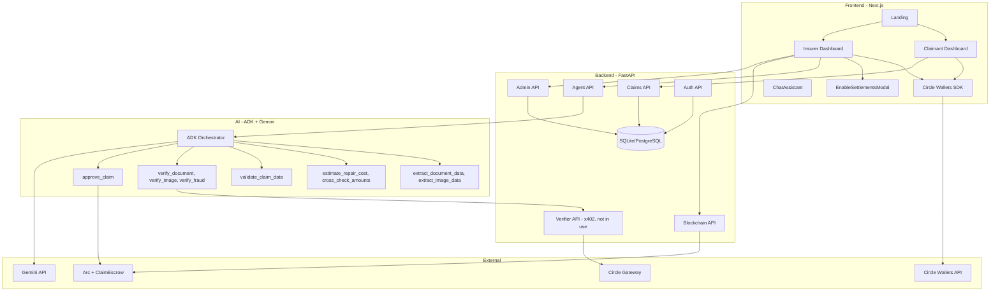
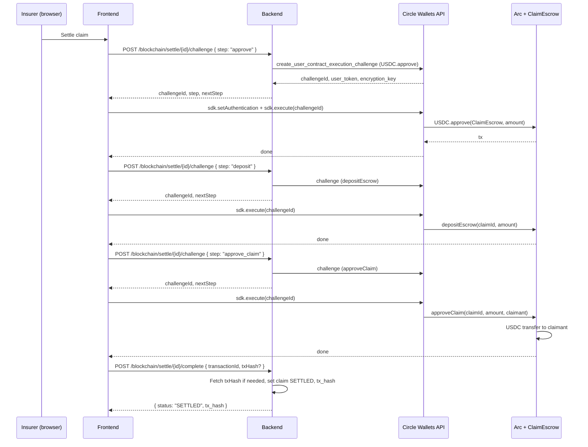

# ClaimLedger — High-Level Design (HLD)

## 1. Executive Summary

ClaimLedger is an **autonomous, multimodal insurance claims platform** built for hackathon demo. It combines:

- **Google ADK + Gemini** – orchestrator with 4-layer tool pipeline (extract → estimate → validate → verify) and six decision types.
- **x402 + Circle Gateway** – micropayments only for verification (~$0.20/claim); extraction and cost checks are free.
- **Arc + ClaimEscrow** – USDC settlement via user-controlled Circle wallets; no backend private keys.
- **Circle Wallets** – claimant and insurer identity and balances.

### Value propositions

| Feature | Benefit |
|---------|---------|
| ADK orchestrator + 9 tools | Autonomous, auditable evaluation with extract / estimate / validate / verify / settle. |
| x402 verification-only | Pay ~$0.20/claim for document, image, fraud checks; free extraction and validation. |
| Fail-closed + auto-approve | No settlement unless confidence ≥ 85%; auto-approve at 95% when fraud &lt; 30%. |
| User-signed settlement | Insurer signs approve → depositEscrow → approveClaim in-browser; no `INSURER_WALLET_PRIVATE_KEY`. |

---

## 2. System overview

### 2.1 Stakeholders

| Role | Description | Actions |
|------|-------------|---------|
| **Claimant** | Policyholder | Submit claims, upload evidence, track status, receive USDC. |
| **Insurer** | Company rep | Trigger evaluation (x402), review AI output, enable settlements, sign 3-step settle. |
| **ADK Orchestrator** | AI agent | Run 4-layer tools, output decision, optionally auto-approve/auto-settle. |

### 2.2 Core workflow

```
┌─────────────┐     ┌─────────────────────────────────────────┐     ┌─────────────┐
│   SUBMIT    │────▶│   EVALUATE (4-layer + verify + decide)  │────▶│   SETTLE    │
│   Claim     │     │   extract → estimate → validate →       │     │   USDC      │
└─────────────┘     │   verify_doc, verify_image, verify_fraud│     └─────────────┘
     │              └─────────────────────────────────────────┘            │
     ▼                        │                                            ▼
  Claimant                    ▼                                    Arc + ClaimEscrow
  uploads              x402 (~$0.20)                                User-signed
  evidence             only for verify_*                             (Circle UCW)
```

---

## 3. System architecture

### 3.1 Architecture diagram



### 3.2 Layers

| Layer | Tech | Responsibility |
|-------|------|----------------|
| **Frontend** | Next.js, TypeScript, Tailwind, Circle Wallets SDK | Landing, Claimant/Insurer UIs, EnableSettlements, ChatAssistant, wallet display. |
| **Backend** | FastAPI, SQLAlchemy, JWT | Claims, Agent (evaluate, status, results, logs, chat), Verifier (x402), Blockchain (challenge/complete), Admin (fees, status), Auth. |
| **AI** | ADK, Gemini | Orchestrator with 9 tools; 4-layer pipeline + verify + approve_claim. |
| **Blockchain** | Arc, ClaimEscrow, USDC | Escrow and release; user-signed via Circle. |
| **External** | Circle Gateway, Circle Wallets, Gemini | x402, balances, sign-in, AI. |

---

## 4. Component overview

### 4.1 Frontend

```
frontend/app/
├── page.tsx                 # Landing: hero, stats, features, role CTAs
├── claimant/page.tsx        # ClaimForm, ClaimStatus, VerificationSteps, ExtractedInfoSummary,
│                            #   DataRequestCard, EvaluationProgress, WalletDisplay
├── insurer/page.tsx         # FinanceKpiStrip, InsurerClaimReview, SettlementCard,
│                            #   AgentResultsBreakdown, AdminFeeTracker, AutoSettleWalletCard,
│                            #   TxValidationStatus, EnableSettlementsModal
├── components/
│   ├── ClaimForm, ClaimStatus, VerificationSteps, ExtractedInfoSummary, DataRequestCard
│   ├── EvaluationProgress, AgentResultsBreakdown, ReviewReasonsList
│   ├── InsurerClaimReview, SettlementCard, FinanceKpiStrip
│   ├── AdminFeeTracker, AutoSettleWalletCard, AutoSettleWalletModal
│   ├── TxValidationStatus, EnableSettlementsModal
│   ├── WalletConnect, WalletDisplay, WalletInfoModal, UserMenu
│   ├── ChatAssistant (not in use), AuthModal, LoginModal, Navbar
│   └── ui/ (Button, Card, Badge, Input, Modal)
└── lib/
    ├── api.ts               # Typed API client
    └── types.ts             # Claim, Evaluation, Settlement, etc.
```

### 4.2 Backend

```
backend/src/
├── main.py, database.py, models.py
├── api/
│   ├── claims.py            # POST/GET /claims, GET /claims/{id}
│   ├── agent.py             # POST /agent/evaluate, GET /agent/status, results, logs (POST /agent/chat: not in use)
│   ├── verifier.py          # x402 document, image, fraud (not in use)
│   ├── blockchain.py        # POST /blockchain/settle/{id}/challenge, /complete
│   ├── admin.py             # GET /admin/fees, /admin/status
│   └── auth.py              # register, login, me, wallet
├── agent/
│   ├── adk_agents/orchestrator_agent.py   # ADK LlmAgent, 4-layer + verify + approve
│   ├── adk_agents/orchestrator.py         # get_adk_orchestrator, evaluate_claim
│   ├── adk_tools.py         # ADK FunctionTools: extract_*, estimate_*, cross_check, validate_*, verify_*, approve_claim
│   ├── adk_schemas.py       # ORCHESTRATOR_SCHEMA, DOCUMENT_SCHEMA, FRAUD_SCHEMA, REASONING_SCHEMA
│   ├── tools.py             # verify_document, verify_image, verify_fraud, approve_claim (x402 / chain)
│   ├── tools_extraction.py  # extract_document_data, extract_image_data (free)
│   ├── tools_cost_estimation.py  # estimate_repair_cost, cross_check_amounts (free)
│   └── tools_validation.py  # validate_claim_data (free)
└── services/
    ├── x402_client.py       # 402 handling, Gateway payment
    ├── gateway.py           # Circle Gateway API
    ├── blockchain.py        # Arc / ClaimEscrow (read). Settlement write via Circle challenge.
    └── circle_wallets.py    # User-controlled wallets, create_user_contract_execution_challenge
```

### 4.3 Smart contract

```solidity
// contracts/src/ClaimEscrow.sol
contract ClaimEscrow {
    IERC20 public usdc;
    mapping(uint256 => uint256) public escrowBalances;
    mapping(uint256 => bool) public settledClaims;

    function depositEscrow(uint256 claimId, uint256 amount) external;
    function approveClaim(uint256 claimId, uint256 amount, address recipient) external;
    function getEscrowBalance(uint256 claimId) external view returns (uint256);
    function isSettled(uint256 claimId) external view returns (bool);

    event EscrowDeposited(uint256 indexed claimId, address indexed depositor, uint256 amount);
    event ClaimSettled(uint256 indexed claimId, address indexed recipient, uint256 amount);
}
```

Settlement: today `POST /blockchain/settle/{id}` may perform a single on-chain step (or mock). The **target** design uses a 3-step user-signed flow via `POST /blockchain/settle/{id}/challenge` and `/complete`: `USDC.approve` → `depositEscrow` → `approveClaim` in the frontend with Circle User-Controlled wallet. See [REAL_USDC_SETTLEMENT.md](REAL_USDC_SETTLEMENT.md).

---

## 5. AI agent: 4-layer pipeline + decisions

### 5.1 Tool layers

| Layer | Tools | Cost | Purpose |
|-------|-------|------|---------|
| 1 – Extract | `extract_document_data`, `extract_image_data` | Free | Get amounts, damage, structure before paying. |
| 2 – Cost | `estimate_repair_cost`, `cross_check_amounts` | Free | Estimate and cross-check claim vs document vs image. |
| 3 – Validate | `validate_claim_data` | Free | Filter invalid/obvious fraud before verify. |
| 4 – Verify | `verify_document`, `verify_image`, `verify_fraud` | x402 | ~$0.05 + $0.10 + $0.05 ≈ $0.20 |
| Settle | `approve_claim` | On-chain | Optional auto-settle when conditions met. |

### 5.2 Decision types

| Decision | Meaning | Typical next step |
|----------|---------|-------------------|
| `AUTO_APPROVED` | Confidence ≥ 95%, no contradictions, fraud &lt; 30% | Can auto-settle. |
| `APPROVED_WITH_REVIEW` | Confidence ≥ 85%, ready for human approve + settle | Insurer reviews and settles. |
| `NEEDS_REVIEW` | 70–85% or contradictions | Manual review. |
| `NEEDS_MORE_DATA` | 50–70% or gaps | Request evidence via `requested_data`. |
| `INSUFFICIENT_DATA` | &lt; 50% | Request evidence or reject. |
| `FRAUD_DETECTED` | fraud_risk ≥ 70% | Reject. |

### 5.3 Thresholds (code-enforced)

- **AUTO_APPROVE**: confidence ≥ 0.95, contradictions = 0, fraud_risk &lt; 0.3.
- **FRAUD_DETECTED**: fraud_risk ≥ 0.7.
- **APPROVED_WITH_REVIEW**: confidence ≥ 0.85, no contradictions.
- **NEEDS_REVIEW**: confidence ≥ 0.70.
- **NEEDS_MORE_DATA**: confidence ≥ 0.50.
- **INSUFFICIENT_DATA**: confidence &lt; 0.50.

---

## 6. x402 and Circle

### 6.1 Verification pricing

| Verifier | Price (USDC) |
|----------|--------------|
| document | $0.05 |
| image | $0.10 |
| fraud | $0.05 |
| **Total (all three)** | **≈ $0.20** |

Extraction, cost estimation, and validation tools do **not** use x402.

### 6.2 Circle Gateway (x402)

- Verifier endpoints return `402 Payment Required` with `X-Payment-Amount`, `X-Gateway-Payment-Id`.
- Agent (via `x402_client`) pays through Circle Gateway and retries with `X-Payment-Receipt`.
- Receipts stored in `x402_receipts` for audit and `GET /admin/fees`.

### 6.3 Circle Wallets (user-controlled)

- Claimant and insurer use Circle User-Controlled wallets.
- Settlement: insurer signs `approve` → `depositEscrow` → `approveClaim` via `create_user_contract_execution_challenge` and frontend `sdk.execute(challengeId)`.
- No `INSURER_WALLET_PRIVATE_KEY`; see [REAL_USDC_SETTLEMENT.md](REAL_USDC_SETTLEMENT.md).

---

## 7. Settlement flow (target: user-signed)

The following is the **target** design from [REAL_USDC_SETTLEMENT.md](REAL_USDC_SETTLEMENT.md). The current `POST /blockchain/settle/{id}` may use a different (e.g. single-call or mock) implementation.



---

## 8. Data flow (simplified)

### 8.1 Claim submission

Claimant → `POST /claims` (form + files) → DB (Claim, Evidence) → `SUBMITTED`.

### 8.2 Evaluation

Insurer → `POST /agent/evaluate/{id}` → ADK Orchestrator:

1. **Extract** (free): `extract_document_data`, `extract_image_data`.
2. **Cost** (free): `estimate_repair_cost`, `cross_check_amounts`.
3. **Validate** (free): `validate_claim_data`.
4. **Verify** (x402): `verify_document`, `verify_image`, `verify_fraud`.
5. **Decide** from tool_results + thresholds; optionally `approve_claim` (auto-settle).

Backend maps `tool_results` → `agent_results`, stores `AgentResult`, `Evaluation`, updates `Claim` (decision, status, `review_reasons`, `requested_data`, `human_review_required`, `auto_approved`, `auto_settled`, `tx_hash`).

### 8.3 Settlement

Insurer (with Circle wallet) → `POST /blockchain/settle/{id}/challenge` for `approve` → `deposit` → `approve_claim`; frontend executes each via SDK. Then `POST /blockchain/settle/{id}/complete` with `transactionId` (and optionally `txHash`). Backend sets `status=SETTLED`, `tx_hash`.

---

## 9. Security and auth

| Layer | Mechanism |
|-------|-----------|
| **Auth** | JWT (email/password). Roles: claimant, insurer. Optional `ADMIN_WALLET_ADDRESS` for admin auto-login. |
| **Wallet** | Circle User-Controlled; `UserWallet` links `user_id` to `circle_wallet_id`, `wallet_address`. |
| **x402** | Insurer’s wallet (from `UserWallet`) is used by agent for verify_* payments via `set_wallet_address`. |
| **Settlement** | All on-chain writes via user-signed Circle challenges; no backend private keys. |
| **Blockchain reads** | `eth_call` for `usdc_allowance`, `getEscrowBalance`; RPC from env. |

---

## 10. Deployment (target)

| Environment | Frontend | Backend | DB | Arc |
|-------------|----------|---------|-----|-----|
| **Local** | localhost:3000 | localhost:8000 | SQLite | Testnet |
| **Prod (e.g. Vercel + Cloud Run)** | Vercel | Cloud Run | PostgreSQL | Testnet / Mainnet |

---

## 11. References

- [Circle – User-Controlled Wallets, contract execution](https://developers.circle.com/api-reference/wallets/user-controlled-wallets/create-user-transaction-contract-execution-challenge)
- [Arc](https://docs.arc.xyz/)
- [Google ADK](https://github.com/google/adk), [Gemini](https://ai.google.dev/docs)
- [x402](https://www.x402.org/)
- [REAL_USDC_SETTLEMENT.md](REAL_USDC_SETTLEMENT.md), [ENVIRONMENT_VARIABLES.md](ENVIRONMENT_VARIABLES.md), [TESTNET_MODE.md](TESTNET_MODE.md)
