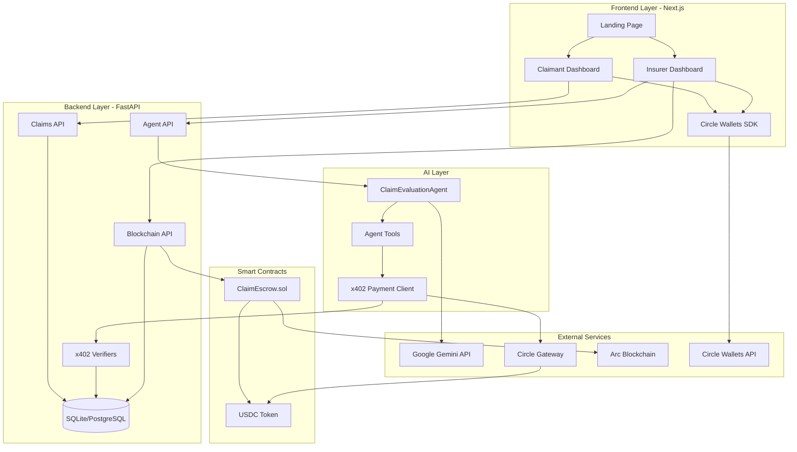
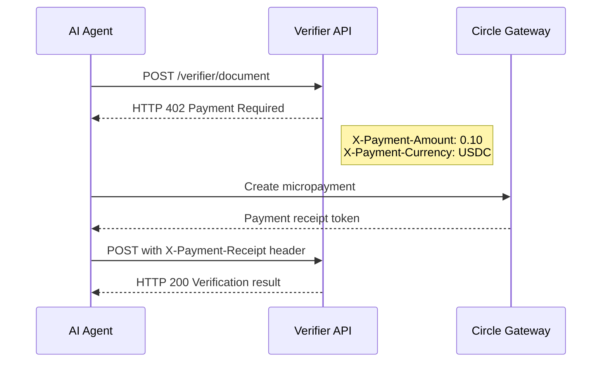
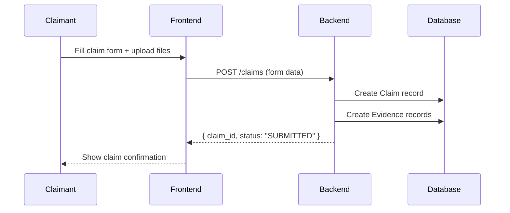
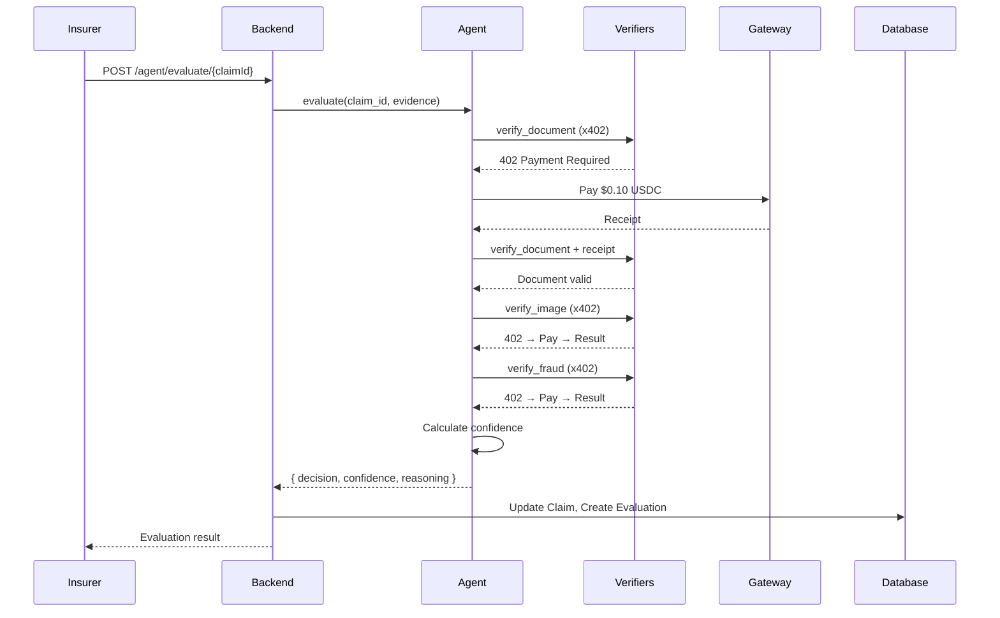
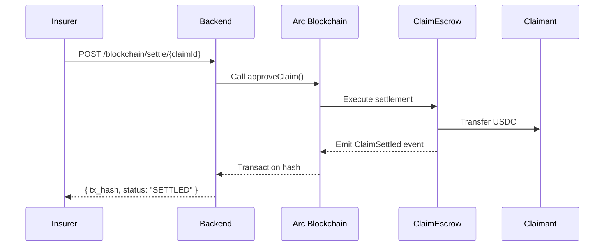

# ClaimLedger - High-Level Design (HLD)

## 1. Executive Summary

ClaimLedger is an autonomous, multimodal insurance claims platform that combines AI-powered evaluation with blockchain-based settlements. The platform demonstrates the integration of:

- **Google Agents Framework** with Gemini for intelligent claim evaluation
- **x402 Protocol** with Circle Gateway for usage-based micropayments
- **Arc Blockchain** with native USDC for transparent settlements
- **Circle Wallets** for secure user wallet management

### Key Value Propositions

| Feature | Benefit |
|---------|---------|
| AI Agent Evaluation | Automated, consistent claim assessment |
| x402 Micropayments | Pay-per-use verification services |
| On-chain Settlement | Transparent, auditable USDC transfers |
| Fail-closed Logic | No funds move unless confidence >= 85% |

---

## 2. System Overview

### 2.1 Stakeholders

| Role | Description | Actions |
|------|-------------|---------|
| **Claimant** | Insurance policyholder | Submit claims, upload evidence, receive settlements |
| **Insurer** | Insurance company | Review AI decisions, trigger settlements |
| **AI Agent** | Autonomous evaluator | Analyze evidence, make decisions, call x402 services |

### 2.2 Core Workflow

```
┌─────────────┐     ┌─────────────┐     ┌─────────────┐     ┌─────────────┐
│   SUBMIT    │────▶│   EVALUATE  │────▶│   APPROVE   │────▶│   SETTLE    │
│   Claim     │     │   via AI    │     │   Decision  │     │   USDC      │
└─────────────┘     └─────────────┘     └─────────────┘     └─────────────┘
     │                    │                   │                   │
     ▼                    ▼                   ▼                   ▼
  Claimant            AI Agent            Insurer           Arc Blockchain
  uploads             calls x402          reviews           transfers USDC
  evidence            verifiers           confidence        to claimant
```

---

## 3. System Architecture

### 3.1 Architecture Diagram



### 3.2 Layer Description

| Layer | Technology | Responsibility |
|-------|------------|----------------|
| **Frontend** | Next.js 14, TypeScript, Tailwind | User interfaces for claimants and insurers |
| **Backend** | FastAPI, Python 3.11+ | REST APIs, business logic, data persistence |
| **AI** | Google Agents Framework, Gemini | Claim evaluation, tool orchestration |
| **Blockchain** | Solidity, Arc | USDC escrow and settlement |
| **External** | Circle, Google | Payments, wallets, AI inference |

---

## 4. Component Details

### 4.1 Frontend Components

```
frontend/
├── app/
│   ├── page.tsx              # Landing page with hero, stats, features
│   ├── layout.tsx            # Root layout with gradient background
│   ├── globals.css           # Design system (glassmorphism, gradients)
│   ├── claimant/page.tsx     # Claimant dashboard
│   └── insurer/page.tsx      # Insurer dashboard
├── components/
│   ├── ui/                   # Base components (Button, Card, Badge, etc.)
│   ├── ClaimForm.tsx         # Claim submission with file upload
│   ├── ClaimStatus.tsx       # Status display with verification steps
│   ├── VerificationSteps.tsx # x402 payment visualization
│   ├── SettlementCard.tsx    # Settlement trigger for insurer
│   ├── WalletConnect.tsx     # Circle Wallets integration
│   └── Navbar.tsx            # Navigation with wallet display
└── lib/
    ├── api.ts                # Typed API client
    └── types.ts              # TypeScript interfaces
```

### 4.2 Backend Components

```
backend/
├── src/
│   ├── main.py               # FastAPI app with lifespan management
│   ├── database.py           # SQLAlchemy session management
│   ├── models.py             # ORM models (Claim, Evidence, etc.)
│   ├── api/
│   │   ├── claims.py         # POST/GET /claims endpoints
│   │   ├── agent.py          # POST /agent/evaluate endpoint
│   │   ├── verifier.py       # x402-protected verification endpoints
│   │   └── blockchain.py     # POST /blockchain/settle endpoint
│   ├── agent/
│   │   ├── agent.py          # ClaimEvaluationAgent class
│   │   └── tools.py          # Agent tools (verify_*, approve_claim)
│   └── services/
│       ├── x402_client.py    # HTTP 402 handler with Gateway payment
│       ├── gateway.py        # Circle Gateway API client
│       └── blockchain.py     # Arc contract interactions
```

### 4.3 Smart Contract

```solidity
// contracts/src/ClaimEscrow.sol
contract ClaimEscrow {
    IERC20 public usdc;
    mapping(uint256 => uint256) public escrowBalances;
    mapping(uint256 => bool) public settledClaims;
    
    function depositEscrow(uint256 claimId, uint256 amount) external;
    function approveClaim(uint256 claimId, uint256 amount, address recipient) external;
    function getEscrowBalance(uint256 claimId) external view returns (uint256);
    function isSettled(uint256 claimId) external view returns (bool);
    
    event EscrowDeposited(uint256 indexed claimId, address indexed depositor, uint256 amount);
    event ClaimSettled(uint256 indexed claimId, address indexed recipient, uint256 amount);
}
```

---

## 5. Technology Stack

### 5.1 Backend Stack

| Component | Technology | Version | Purpose |
|-----------|------------|---------|---------|
| Runtime | Python | 3.11+ | Primary language |
| Framework | FastAPI | 0.104+ | REST API framework |
| ORM | SQLAlchemy | 2.0+ | Database abstraction |
| Database | SQLite/PostgreSQL | - | Data persistence |
| AI SDK | google-genai | 0.2+ | Gemini API client |
| HTTP Client | httpx | 0.25+ | Async HTTP requests |

### 5.2 Frontend Stack

| Component | Technology | Version | Purpose |
|-----------|------------|---------|---------|
| Framework | Next.js | 14+ | React framework |
| Language | TypeScript | 5+ | Type safety |
| Styling | Tailwind CSS | 3+ | Utility-first CSS |
| Web3 | wagmi/viem | - | Blockchain interactions |
| Wallets | Circle Wallets SDK | - | Wallet-as-a-service |

### 5.3 Blockchain Stack

| Component | Technology | Purpose |
|-----------|------------|---------|
| Language | Solidity 0.8.20 | Smart contract development |
| Toolkit | Foundry | Build, test, deploy |
| Network | Arc Testnet | Settlement layer |
| Token | USDC | Native gas + payments |

---

## 6. External Integrations

### 6.1 Circle Gateway (x402 Micropayments)



**Pricing Model:**
| Verifier | Price (USDC) |
|----------|--------------|
| Document | $0.10 |
| Image | $0.15 |
| Fraud | $0.10 |
| **Total per claim** | **$0.35** |

### 6.2 Circle Wallets

- **Purpose:** Wallet-as-a-service for claimants and insurers
- **Features:** MPC-secured keys, unified balance across chains
- **Integration:** Frontend SDK for wallet connection and signing

### 6.3 Arc Blockchain

- **Purpose:** Settlement layer for USDC transfers
- **Features:** EVM-compatible, native USDC gas
- **Contract:** ClaimEscrow deployed on Arc testnet

### 6.4 Google Gemini

- **Model:** gemini-2.0-flash (configurable)
- **Purpose:** Multimodal reasoning for claim evaluation
- **Features:** Tool calling, structured output, image analysis

---

## 7. Data Flow

### 7.1 Claim Submission Flow



### 7.2 Agent Evaluation Flow



### 7.3 Settlement Flow



---

## 8. Security Considerations

### 8.1 Authentication & Authorization

| Layer | Mechanism |
|-------|-----------|
| Frontend | Circle Wallets (wallet-based auth) |
| Backend | Wallet address validation |
| Blockchain | Transaction signing |

### 8.2 Data Protection

- **Evidence files:** Stored locally (demo) or IPFS (production)
- **Payment receipts:** Stored in database for audit trail
- **Wallet keys:** Managed by Circle (MPC-secured)

### 8.3 Smart Contract Security

- **Access control:** Public functions with require() checks
- **Reentrancy:** No external calls before state updates
- **Input validation:** Amount > 0, valid addresses

---

## 9. Deployment Architecture

### 9.1 Development Environment

```
┌─────────────────────────────────────────────────────────────┐
│                    Local Development                         │
├─────────────────┬─────────────────┬─────────────────────────┤
│   Frontend      │    Backend      │    Database             │
│   localhost:3000│    localhost:8000│    SQLite (local file) │
├─────────────────┴─────────────────┴─────────────────────────┤
│                    Arc Testnet                               │
│                    ClaimEscrow Contract                      │
└─────────────────────────────────────────────────────────────┘
```

### 9.2 Production Architecture (Future)

```
┌─────────────────────────────────────────────────────────────┐
│                    Cloud Infrastructure                      │
├─────────────────┬─────────────────┬─────────────────────────┤
│   Vercel/CDN    │    Cloud Run    │    PostgreSQL           │
│   (Frontend)    │    (Backend)    │    (Managed DB)         │
├─────────────────┴─────────────────┴─────────────────────────┤
│                    Arc Mainnet                               │
│                    ClaimEscrow Contract                      │
└─────────────────────────────────────────────────────────────┘
```

---

## 10. Non-Functional Requirements

### 10.1 Performance

| Metric | Target |
|--------|--------|
| Claim submission | < 2 seconds |
| Agent evaluation | < 30 seconds |
| Settlement confirmation | < 15 seconds |

### 10.2 Scalability

- **Stateless backend:** Horizontally scalable
- **Database:** Connection pooling enabled
- **Blockchain:** Arc handles settlement throughput

### 10.3 Availability

- **Demo target:** 99% uptime during hackathon
- **Recovery:** Manual restart, database persistence

---

## 11. Future Enhancements

| Feature | Description | Priority |
|---------|-------------|----------|
| Multi-policy support | Multiple insurance policies per user | Medium |
| Dispute resolution | Challenge AI decisions | Low |
| IPFS storage | Decentralized evidence storage | Medium |
| WebSocket updates | Real-time status notifications | Medium |
| Analytics dashboard | Claim statistics and trends | Low |

---

## 12. References

- [Circle Gateway Documentation](https://developers.circle.com/w3s/docs/circle-programmable-wallets-an-overview)
- [Arc Blockchain Documentation](https://docs.arc.xyz/)
- [Google Agents Framework](https://ai.google.dev/docs)
- [x402 Protocol Specification](https://www.x402.org/)
