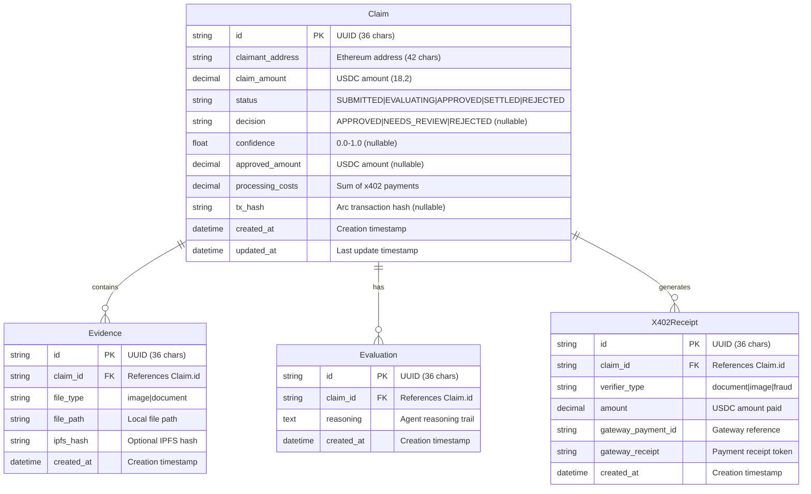
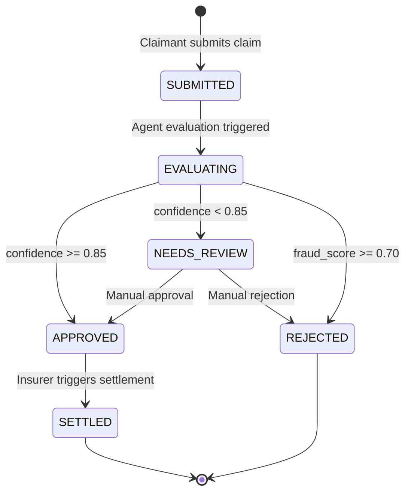
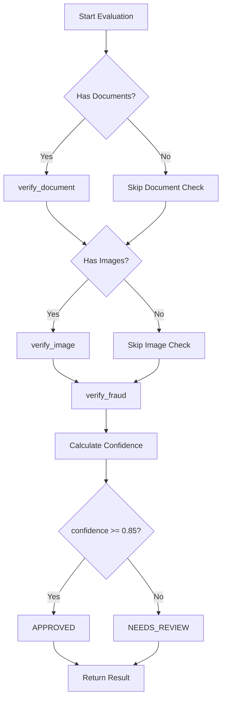
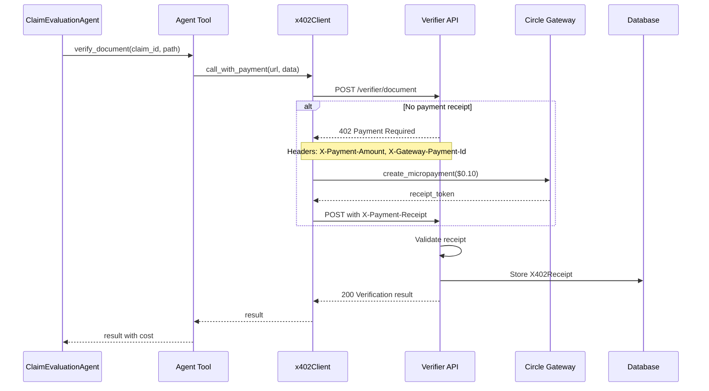
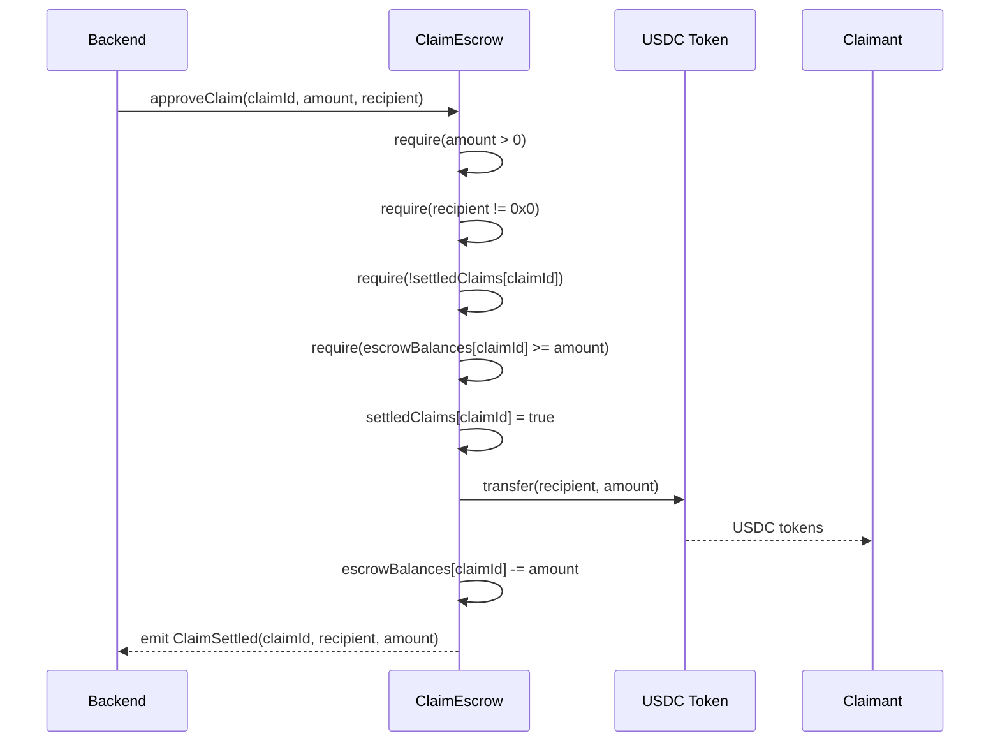
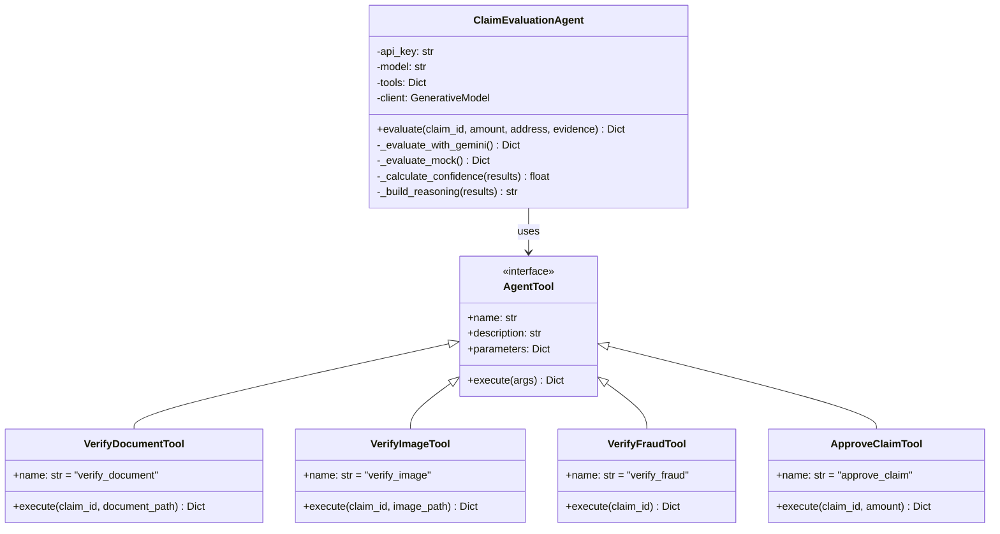
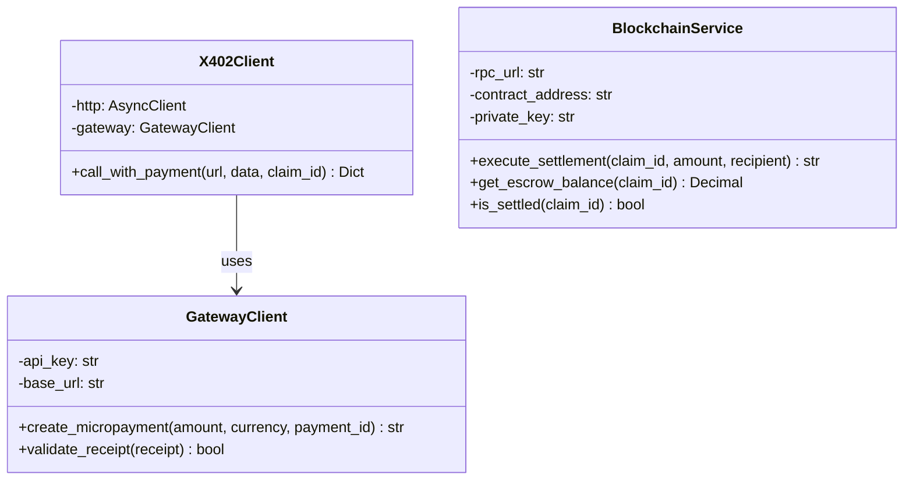
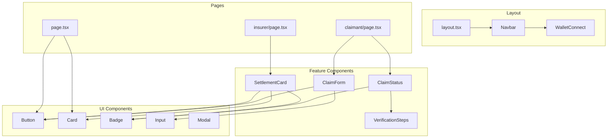

# ClaimLedger - Low-Level Design (LLD)

## 1. Database Design

### 1.1 Entity-Relationship Diagram



### 1.2 Table Definitions

#### Claims Table

```sql
CREATE TABLE claims (
    id VARCHAR(36) PRIMARY KEY,
    claimant_address VARCHAR(42) NOT NULL,
    claim_amount DECIMAL(18, 2) NOT NULL,
    status VARCHAR(20) NOT NULL DEFAULT 'SUBMITTED',
    decision VARCHAR(20),
    confidence FLOAT,
    approved_amount DECIMAL(18, 2),
    processing_costs DECIMAL(18, 2) NOT NULL DEFAULT 0.00,
    tx_hash VARCHAR(66),
    created_at TIMESTAMP NOT NULL DEFAULT CURRENT_TIMESTAMP,
    updated_at TIMESTAMP NOT NULL DEFAULT CURRENT_TIMESTAMP,
    
    CONSTRAINT chk_status CHECK (status IN ('SUBMITTED', 'EVALUATING', 'APPROVED', 'SETTLED', 'REJECTED')),
    CONSTRAINT chk_decision CHECK (decision IN ('APPROVED', 'NEEDS_REVIEW', 'REJECTED') OR decision IS NULL),
    CONSTRAINT chk_confidence CHECK (confidence >= 0.0 AND confidence <= 1.0 OR confidence IS NULL)
);
```

#### Evidence Table

```sql
CREATE TABLE evidence (
    id VARCHAR(36) PRIMARY KEY,
    claim_id VARCHAR(36) NOT NULL,
    file_type VARCHAR(20) NOT NULL,
    file_path VARCHAR(255) NOT NULL,
    ipfs_hash VARCHAR(64),
    created_at TIMESTAMP NOT NULL DEFAULT CURRENT_TIMESTAMP,
    
    CONSTRAINT fk_claim FOREIGN KEY (claim_id) REFERENCES claims(id) ON DELETE CASCADE,
    CONSTRAINT chk_file_type CHECK (file_type IN ('image', 'document'))
);
```

#### Evaluations Table

```sql
CREATE TABLE evaluations (
    id VARCHAR(36) PRIMARY KEY,
    claim_id VARCHAR(36) NOT NULL,
    reasoning TEXT NOT NULL,
    created_at TIMESTAMP NOT NULL DEFAULT CURRENT_TIMESTAMP,
    
    CONSTRAINT fk_claim FOREIGN KEY (claim_id) REFERENCES claims(id) ON DELETE CASCADE
);
```

#### X402 Receipts Table

```sql
CREATE TABLE x402_receipts (
    id VARCHAR(36) PRIMARY KEY,
    claim_id VARCHAR(36) NOT NULL,
    verifier_type VARCHAR(20) NOT NULL,
    amount DECIMAL(18, 2) NOT NULL,
    gateway_payment_id VARCHAR(255) NOT NULL,
    gateway_receipt VARCHAR(255) NOT NULL,
    created_at TIMESTAMP NOT NULL DEFAULT CURRENT_TIMESTAMP,
    
    CONSTRAINT fk_claim FOREIGN KEY (claim_id) REFERENCES claims(id) ON DELETE CASCADE,
    CONSTRAINT chk_verifier_type CHECK (verifier_type IN ('document', 'image', 'fraud'))
);
```

### 1.3 Indexes

```sql
CREATE INDEX idx_claims_status ON claims(status);
CREATE INDEX idx_claims_claimant ON claims(claimant_address);
CREATE INDEX idx_claims_created ON claims(created_at DESC);
CREATE INDEX idx_evidence_claim ON evidence(claim_id);
CREATE INDEX idx_evaluations_claim ON evaluations(claim_id);
CREATE INDEX idx_receipts_claim ON x402_receipts(claim_id);
```

---

## 2. API Specifications

### 2.1 Claims API

#### POST /claims - Create Claim

**Request:**
```http
POST /claims HTTP/1.1
Content-Type: multipart/form-data

claimant_address: 0xABCDEF1234567890ABCDEF1234567890ABCDEF12
claim_amount: 1250.00
files: [invoice.pdf, damage.jpg]
```

**Response (201 Created):**
```json
{
  "claim_id": "550e8400-e29b-41d4-a716-446655440000",
  "status": "SUBMITTED"
}
```

**Validation Rules:**
- `claimant_address`: Valid Ethereum address (42 chars, starts with 0x)
- `claim_amount`: Positive decimal number
- `files`: Optional, accepts image/* and .pdf/.doc/.docx

#### GET /claims/{claim_id} - Get Claim Status

**Request:**
```http
GET /claims/550e8400-e29b-41d4-a716-446655440000 HTTP/1.1
```

**Response (200 OK):**
```json
{
  "id": "550e8400-e29b-41d4-a716-446655440000",
  "claimant_address": "0xABCDEF1234567890ABCDEF1234567890ABCDEF12",
  "claim_amount": 1250.00,
  "status": "APPROVED",
  "decision": "APPROVED",
  "confidence": 0.92,
  "approved_amount": 1250.00,
  "processing_costs": 0.35,
  "tx_hash": null,
  "created_at": "2024-01-15T10:30:00Z"
}
```

**Error Responses:**
| Status | Condition |
|--------|-----------|
| 400 | Invalid UUID format |
| 404 | Claim not found |

### 2.2 Agent API

#### POST /agent/evaluate/{claim_id} - Trigger Evaluation

**Request:**
```http
POST /agent/evaluate/550e8400-e29b-41d4-a716-446655440000 HTTP/1.1
```

**Response (200 OK):**
```json
{
  "claim_id": "550e8400-e29b-41d4-a716-446655440000",
  "decision": "APPROVED",
  "confidence": 0.92,
  "approved_amount": 1250.00,
  "reasoning": "Document verified: $1,250.00 repair invoice. Image analysis shows collision damage to front_bumper, hood. Severity: moderate. Fraud score: 0.05 (LOW risk). Confidence: 92%. Recommendation: APPROVED",
  "processing_costs": 0.35
}
```

**Processing Steps:**
1. Fetch claim and evidence from database
2. Initialize ClaimEvaluationAgent
3. Execute tool sequence (verify_document → verify_image → verify_fraud)
4. Calculate confidence score
5. Update claim status and create evaluation record

### 2.3 Verifier API (x402-Protected)

#### POST /verifier/document - Document Verification

**Request (without payment):**
```http
POST /verifier/document HTTP/1.1
Content-Type: application/json

{
  "claim_id": "550e8400-e29b-41d4-a716-446655440000",
  "document_path": "uploads/550e8400/invoice.pdf"
}
```

**Response (402 Payment Required):**
```http
HTTP/1.1 402 Payment Required
X-Payment-Amount: 0.10
X-Payment-Currency: USDC
X-Payment-Description: Document verification fee
X-Gateway-Payment-Id: a1b2c3d4-e5f6-7890-abcd-ef1234567890

{
  "error": "Payment required",
  "amount": "0.10",
  "currency": "USDC",
  "gateway_payment_id": "a1b2c3d4-e5f6-7890-abcd-ef1234567890",
  "payment_url": "https://gateway.circle.com/pay/a1b2c3d4-e5f6-7890-abcd-ef1234567890",
  "description": "Document verification fee"
}
```

**Request (with payment receipt):**
```http
POST /verifier/document HTTP/1.1
Content-Type: application/json
X-Payment-Receipt: eyJhbGciOiJIUzI1NiIsInR5cCI6IkpXVCJ9...

{
  "claim_id": "550e8400-e29b-41d4-a716-446655440000",
  "document_path": "uploads/550e8400/invoice.pdf"
}
```

**Response (200 OK):**
```json
{
  "extracted_data": {
    "document_type": "invoice",
    "amount": 3500.00,
    "date": "2024-01-15",
    "vendor": "Auto Repair Shop",
    "description": "Front bumper repair and replacement"
  },
  "valid": true,
  "verification_id": "ver-123-456"
}
```

#### POST /verifier/image - Image Analysis

**Price:** $0.15 USDC

**Response (200 OK with valid receipt):**
```json
{
  "damage_assessment": {
    "damage_type": "collision",
    "affected_parts": ["front_bumper", "hood"],
    "severity": "moderate",
    "estimated_cost": 3500.00,
    "confidence": 0.89
  },
  "valid": true,
  "analysis_id": "img-789-012"
}
```

#### POST /verifier/fraud - Fraud Detection

**Price:** $0.10 USDC

**Response (200 OK with valid receipt):**
```json
{
  "fraud_score": 0.05,
  "risk_level": "LOW",
  "check_id": "fraud-345-678"
}
```

**Risk Level Thresholds:**
| Score Range | Risk Level |
|-------------|------------|
| 0.00 - 0.29 | LOW |
| 0.30 - 0.69 | MEDIUM |
| 0.70 - 1.00 | HIGH |

### 2.4 Blockchain API

#### POST /blockchain/settle/{claim_id} - Settle Claim

**Request:**
```http
POST /blockchain/settle/550e8400-e29b-41d4-a716-446655440000 HTTP/1.1
Content-Type: application/json

{}
```

**Response (200 OK):**
```json
{
  "claim_id": "550e8400-e29b-41d4-a716-446655440000",
  "tx_hash": "0x3d42c562fad62abd3bc282464cb1751845451b449b18f0c908fc2f4cd91f6811",
  "amount": 1250.00,
  "recipient": "0xABCDEF1234567890ABCDEF1234567890ABCDEF12",
  "status": "SETTLED"
}
```

**Preconditions:**
- Claim status must be "APPROVED"
- Claim must have approved_amount set
- Claim must not already be settled

---

## 3. Claim Status State Machine



### State Descriptions

| State | Description | Next Actions |
|-------|-------------|--------------|
| SUBMITTED | Claim created, awaiting evaluation | Trigger evaluation |
| EVALUATING | AI agent processing claim | Wait for completion |
| APPROVED | Agent approved, awaiting settlement | Trigger settlement |
| NEEDS_REVIEW | Low confidence, manual review needed | Manual approve/reject |
| REJECTED | Claim denied | None (terminal) |
| SETTLED | USDC transferred on Arc | None (terminal) |

---

## 4. Agent Decision Logic

### 4.1 Tool Sequence



### 4.2 Confidence Calculation

```python
def calculate_confidence(tool_results: List[tuple]) -> float:
    """
    Calculate overall confidence from tool results.
    
    Weights:
    - Document verification: 40%
    - Image analysis: 30%
    - Fraud check: 30%
    """
    scores = []
    
    for tool_name, result in tool_results:
        if not result.get("success", False):
            scores.append(0.0)
            continue
        
        if tool_name == "verify_document":
            # Valid document = high score
            scores.append(0.95 if result.get("valid") else 0.3)
        
        elif tool_name == "verify_image":
            # Use damage assessment confidence
            if result.get("valid"):
                assessment = result.get("damage_assessment", {})
                scores.append(assessment.get("confidence", 0.85))
            else:
                scores.append(0.3)
        
        elif tool_name == "verify_fraud":
            # Lower fraud score = higher confidence
            fraud_score = result.get("fraud_score", 0.5)
            scores.append(1.0 - fraud_score)
    
    # Simple average (equal weights for demo)
    return sum(scores) / len(scores) if scores else 0.0
```

### 4.3 Decision Rules

| Condition | Decision | Action |
|-----------|----------|--------|
| confidence >= 0.85 | APPROVED | Agent can trigger settlement |
| 0.50 <= confidence < 0.85 | NEEDS_REVIEW | Manual review required |
| confidence < 0.50 OR fraud >= 0.70 | REJECTED | Claim denied |

---

## 5. x402 Payment Flow

### 5.1 Detailed Sequence



### 5.2 x402 Client Implementation

```python
class X402Client:
    """HTTP client that handles 402 Payment Required responses."""
    
    async def call_with_payment(
        self,
        url: str,
        data: dict,
        claim_id: str
    ) -> dict:
        """
        Make API call, handle 402 with Gateway payment.
        
        Args:
            url: API endpoint URL
            data: Request payload
            claim_id: Claim ID for payment tracking
            
        Returns:
            API response data
        """
        # Initial request without payment
        response = await self.http.post(url, json=data)
        
        if response.status_code == 402:
            # Extract payment details from response
            payment_info = response.json()
            amount = Decimal(payment_info["amount"])
            payment_id = payment_info["gateway_payment_id"]
            
            # Create payment via Circle Gateway
            receipt = await self.gateway.create_micropayment(
                amount=amount,
                currency="USDC",
                payment_id=payment_id
            )
            
            # Retry with payment receipt
            response = await self.http.post(
                url,
                json=data,
                headers={"X-Payment-Receipt": receipt}
            )
        
        response.raise_for_status()
        return response.json()
```

### 5.3 Receipt Validation

```python
def verify_payment_receipt(
    receipt: str,
    expected_amount: Decimal,
    verifier_type: str,
    claim_id: str,
    db: Session
) -> bool:
    """
    Validate payment receipt from Circle Gateway.
    
    Production implementation would:
    1. Decode JWT receipt token
    2. Verify signature with Gateway public key
    3. Check amount matches expected
    4. Check payment not already used
    
    Demo implementation accepts any non-empty receipt.
    """
    if not receipt:
        return False
    
    # Store receipt for audit trail
    x402_receipt = X402Receipt(
        id=str(uuid.uuid4()),
        claim_id=claim_id,
        verifier_type=verifier_type,
        amount=expected_amount,
        gateway_payment_id=receipt[:36],
        gateway_receipt=receipt,
        created_at=datetime.utcnow()
    )
    db.add(x402_receipt)
    db.commit()
    
    return True
```

---

## 6. Smart Contract Interface

### 6.1 Contract ABI

```json
{
  "abi": [
    {
      "name": "depositEscrow",
      "type": "function",
      "inputs": [
        { "name": "claimId", "type": "uint256" },
        { "name": "amount", "type": "uint256" }
      ],
      "outputs": []
    },
    {
      "name": "approveClaim",
      "type": "function",
      "inputs": [
        { "name": "claimId", "type": "uint256" },
        { "name": "amount", "type": "uint256" },
        { "name": "recipient", "type": "address" }
      ],
      "outputs": []
    },
    {
      "name": "getEscrowBalance",
      "type": "function",
      "inputs": [
        { "name": "claimId", "type": "uint256" }
      ],
      "outputs": [
        { "name": "balance", "type": "uint256" }
      ],
      "stateMutability": "view"
    },
    {
      "name": "isSettled",
      "type": "function",
      "inputs": [
        { "name": "claimId", "type": "uint256" }
      ],
      "outputs": [
        { "name": "settled", "type": "bool" }
      ],
      "stateMutability": "view"
    },
    {
      "name": "EscrowDeposited",
      "type": "event",
      "inputs": [
        { "name": "claimId", "type": "uint256", "indexed": true },
        { "name": "depositor", "type": "address", "indexed": true },
        { "name": "amount", "type": "uint256", "indexed": false }
      ]
    },
    {
      "name": "ClaimSettled",
      "type": "event",
      "inputs": [
        { "name": "claimId", "type": "uint256", "indexed": true },
        { "name": "recipient", "type": "address", "indexed": true },
        { "name": "amount", "type": "uint256", "indexed": false }
      ]
    }
  ]
}
```

### 6.2 Settlement Flow



### 6.3 Gas Estimation

| Function | Estimated Gas | USDC Cost* |
|----------|--------------|------------|
| depositEscrow | ~65,000 | ~$0.01 |
| approveClaim | ~75,000 | ~$0.01 |
| getEscrowBalance | ~25,000 | Free (view) |

*Assuming Arc gas price ~0.1 gwei equivalent

---

## 7. Error Handling

### 7.1 HTTP Error Responses

```python
class ErrorResponse(BaseModel):
    """Standard error response format."""
    detail: str
    error_code: Optional[str] = None
    timestamp: datetime = Field(default_factory=datetime.utcnow)

# Example responses
ERROR_RESPONSES = {
    400: {"detail": "Invalid request parameters"},
    401: {"detail": "Authentication required"},
    402: {"detail": "Payment required", "error_code": "PAYMENT_REQUIRED"},
    404: {"detail": "Resource not found"},
    409: {"detail": "Conflict - claim already settled"},
    422: {"detail": "Validation error"},
    500: {"detail": "Internal server error"}
}
```

### 7.2 Error Codes

| Code | HTTP Status | Description |
|------|-------------|-------------|
| INVALID_UUID | 400 | Claim ID is not valid UUID format |
| CLAIM_NOT_FOUND | 404 | No claim exists with given ID |
| PAYMENT_REQUIRED | 402 | x402 payment needed for verifier |
| INVALID_RECEIPT | 400 | Payment receipt is invalid or expired |
| CLAIM_NOT_APPROVED | 409 | Cannot settle - claim not approved |
| ALREADY_SETTLED | 409 | Claim has already been settled |
| INSUFFICIENT_ESCROW | 400 | Not enough USDC in escrow |
| BLOCKCHAIN_ERROR | 500 | Transaction failed on Arc |

### 7.3 Retry Strategy

```python
class RetryConfig:
    """Configuration for API retry logic."""
    max_retries: int = 3
    base_delay: float = 1.0  # seconds
    max_delay: float = 10.0  # seconds
    exponential_base: float = 2.0
    
    def get_delay(self, attempt: int) -> float:
        """Calculate delay with exponential backoff."""
        delay = self.base_delay * (self.exponential_base ** attempt)
        return min(delay, self.max_delay)

# Retry for transient failures
RETRYABLE_ERRORS = {
    502,  # Bad Gateway
    503,  # Service Unavailable
    504,  # Gateway Timeout
}
```

---

## 8. Class Diagrams

### 8.1 Agent Classes



### 8.2 Service Classes



---

## 9. Frontend Components

### 9.1 Component Hierarchy



### 9.2 State Management

```typescript
// lib/types.ts
interface ClaimState {
  currentClaimId: string | null;
  claim: Claim | null;
  loading: boolean;
  error: string | null;
}

interface WalletState {
  address: string | undefined;
  connected: boolean;
  connecting: boolean;
}

// Component state flow
// 1. ClaimForm submits → API returns claim_id
// 2. claim_id stored in state → triggers ClaimStatus fetch
// 3. ClaimStatus polls for updates → reflects status changes
// 4. Settlement triggers blockchain tx → returns tx_hash
```

---

## 10. Configuration

### 10.1 Environment Variables

```bash
# Backend (.env)
DATABASE_URL=sqlite:///./claimledger.db
GOOGLE_AI_API_KEY=your-google-ai-key
AGENT_MODEL=gemini-2.0-flash
CIRCLE_GATEWAY_API_KEY=your-gateway-key
CIRCLE_WALLETS_API_KEY=your-wallets-key
ARC_RPC_URL=https://arc-testnet.rpc.caldera.xyz/http
CLAIM_ESCROW_CONTRACT=0x...

# Frontend (.env.local)
NEXT_PUBLIC_API_URL=http://localhost:8000
NEXT_PUBLIC_ARC_RPC_URL=https://arc-testnet.rpc.caldera.xyz/http
NEXT_PUBLIC_ARC_CHAIN_ID=19850818
NEXT_PUBLIC_CIRCLE_APP_ID=your-app-id
```

### 10.2 x402 Pricing Configuration

```python
# backend/src/api/verifier.py
VERIFIER_PRICING = {
    "document": Decimal("0.10"),  # $0.10 USDC
    "image": Decimal("0.15"),     # $0.15 USDC
    "fraud": Decimal("0.10"),     # $0.10 USDC
}

# Total expected cost per claim: $0.35 USDC
```

---

## 11. Testing Strategy

### 11.1 Unit Tests

```python
# tests/test_agent.py
class TestClaimEvaluationAgent:
    async def test_evaluate_mock_approved(self):
        """Test agent approves valid claim."""
        agent = ClaimEvaluationAgent()
        result = await agent.evaluate(
            claim_id="test-123",
            claim_amount=Decimal("1000"),
            claimant_address="0xABC...",
            evidence=[{"file_type": "document", "file_path": "..."}]
        )
        assert result["decision"] == "APPROVED"
        assert result["confidence"] >= 0.85
    
    async def test_evaluate_mock_needs_review(self):
        """Test agent flags low confidence claim."""
        # ... test implementation
```

### 11.2 Integration Tests

```bash
# scripts/test-e2e.sh
#!/bin/bash

# 1. Create claim
CLAIM_ID=$(curl -X POST http://localhost:8000/claims \
  -F "claimant_address=0xABC..." \
  -F "claim_amount=1000" | jq -r '.claim_id')

# 2. Trigger evaluation
curl -X POST "http://localhost:8000/agent/evaluate/$CLAIM_ID"

# 3. Settle claim
curl -X POST "http://localhost:8000/blockchain/settle/$CLAIM_ID"

# 4. Verify final status
curl "http://localhost:8000/claims/$CLAIM_ID"
```

---

## 12. Appendix

### 12.1 TypeScript Interfaces

```typescript
// frontend/lib/types.ts
export type ClaimStatus = 
  | 'SUBMITTED' 
  | 'EVALUATING' 
  | 'APPROVED' 
  | 'SETTLED' 
  | 'REJECTED' 
  | 'NEEDS_REVIEW';

export interface Claim {
  id: string;
  claimant_address: string;
  claim_amount: number;
  status: ClaimStatus;
  decision: 'APPROVED' | 'NEEDS_REVIEW' | 'REJECTED' | null;
  confidence: number | null;
  approved_amount: number | null;
  processing_costs: number | null;
  tx_hash: string | null;
  created_at: string;
}

export interface EvaluationResult {
  claim_id: string;
  decision: string;
  confidence: number;
  approved_amount: number | null;
  reasoning: string;
  processing_costs: number;
}

export interface SettlementResult {
  claim_id: string;
  tx_hash: string;
  amount: number;
  recipient: string;
  status: 'SETTLED';
}
```

### 12.2 Pydantic Models

```python
# backend/src/api/claims.py
class ClaimResponse(BaseModel):
    id: str
    claimant_address: str
    claim_amount: float
    status: str
    decision: Optional[str] = None
    confidence: Optional[float] = None
    approved_amount: Optional[float] = None
    processing_costs: Optional[float] = None
    tx_hash: Optional[str] = None
    created_at: datetime

    class Config:
        from_attributes = True

class ClaimCreateResponse(BaseModel):
    claim_id: str
    status: str
```
