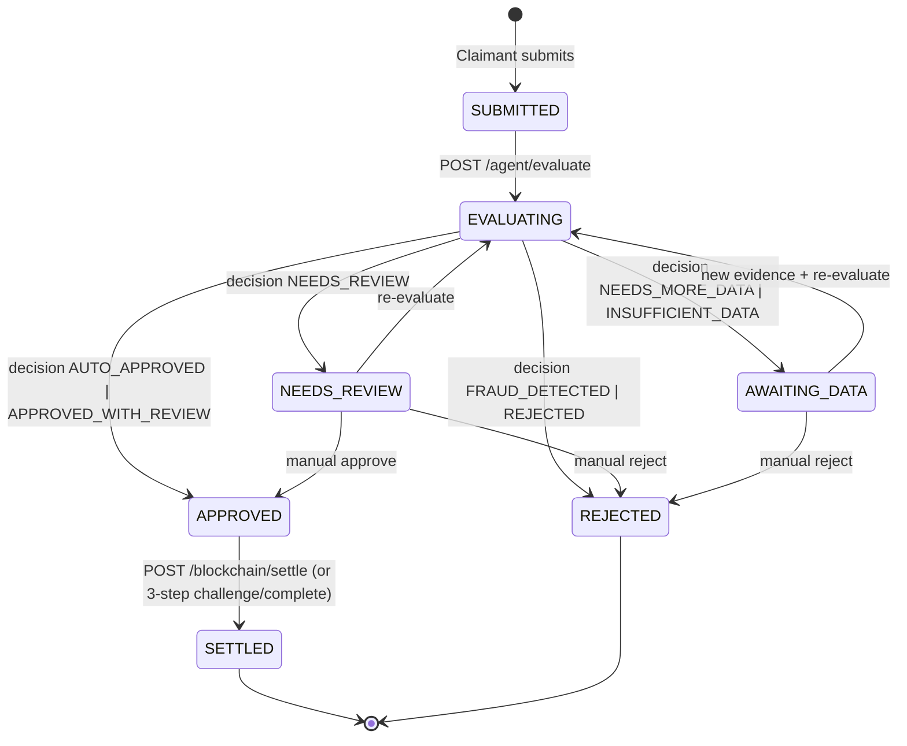
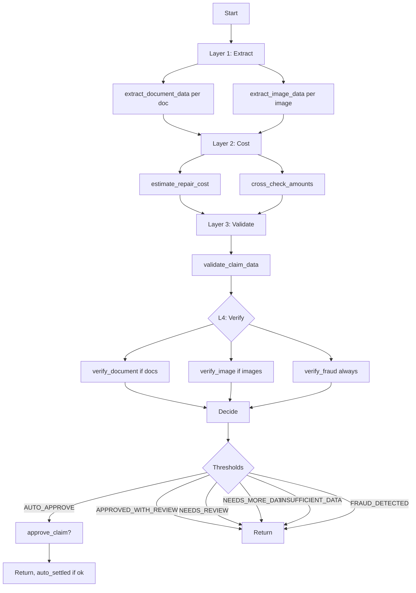
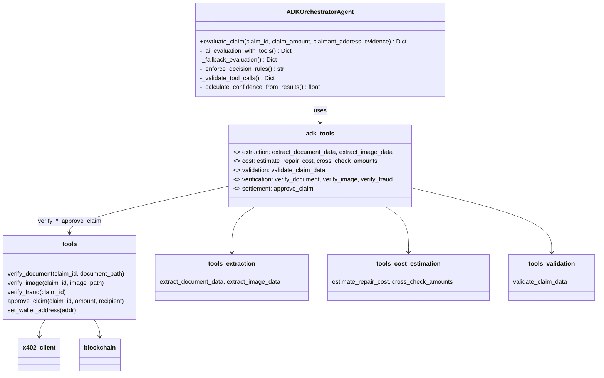

# ClaimLedger — Low-Level Design (LLD)

## 1. Database design

### 1.1 Entities

```mermaid
erDiagram
    Claim ||--o{ Evidence : contains
    Claim ||--o{ Evaluation : has
    Claim ||--o{ X402Receipt : generates
    Claim ||--o{ AgentResult : has
    Claim ||--o{ AgentLog : has
    User ||--o| UserWallet : has

    Claim {
        string id PK
        string claimant_address
        decimal claim_amount
        text description
        string status "SUBMITTED|EVALUATING|APPROVED|SETTLED|REJECTED|NEEDS_REVIEW|AWAITING_DATA"
        string decision "AUTO_APPROVED|APPROVED_WITH_REVIEW|NEEDS_REVIEW|NEEDS_MORE_DATA|INSUFFICIENT_DATA|FRAUD_DETECTED|REJECTED"
        float confidence
        decimal approved_amount
        decimal processing_costs
        string tx_hash
        bool auto_approved
        bool auto_settled
        text comprehensive_summary
        json review_reasons
        json requested_data
        bool human_review_required
        datetime created_at
        datetime updated_at
    }

    Evidence { string id PK, string claim_id FK, string file_type, string file_path, string ipfs_hash, int file_size, string mime_type, json analysis_metadata, string processing_status, datetime created_at }

    Evaluation { string id PK, string claim_id FK, text reasoning, datetime created_at }

    X402Receipt { string id PK, string claim_id FK, string verifier_type, decimal amount, string gateway_payment_id, string gateway_receipt, datetime created_at }

    User { string id PK, string email, string password_hash, string role, datetime created_at, datetime updated_at }

    UserWallet { string id PK, string user_id FK, string wallet_address, string circle_wallet_id, string wallet_set_id, datetime created_at, datetime updated_at }

    AgentResult { string id PK, string claim_id FK, string agent_type, json result, float confidence, datetime created_at }

    AgentLog { string id PK, string claim_id FK, string agent_type, text message, string log_level, json log_metadata, datetime created_at }
```

### 1.2 Claim status and decision

| status | Meaning |
|--------|---------|
| SUBMITTED | Claim created, awaiting evaluation |
| EVALUATING | Agent running (4-layer + verify) |
| APPROVED | Ready for settlement (APPROVED_WITH_REVIEW or AUTO_APPROVED) |
| SETTLED | USDC transferred, tx_hash set |
| REJECTED | Denied (e.g. FRAUD_DETECTED) |
| NEEDS_REVIEW | 70–85% or contradictions; manual review |
| AWAITING_DATA | NEEDS_MORE_DATA or INSUFFICIENT_DATA; waiting for `requested_data` |

| decision | Meaning |
|----------|---------|
| AUTO_APPROVED | Confidence ≥ 95%, no contradictions, fraud &lt; 30% |
| APPROVED_WITH_REVIEW | Confidence ≥ 85%; insurer must approve and settle |
| NEEDS_REVIEW | 70–85% or contradictions |
| NEEDS_MORE_DATA | 50–70% or evidence gaps |
| INSUFFICIENT_DATA | &lt; 50% |
| FRAUD_DETECTED | fraud_risk ≥ 70% |
| REJECTED | Terminal reject (e.g. manual) |

### 1.3 AgentResult.agent_type

Stored as: `document`, `image`, `fraud` (mapped from tool names `verify_document`, `verify_image`, `verify_fraud`). The orchestrator’s `tool_results` are converted to this form before persisting.

### 1.4 Indexes (typical)

```sql
CREATE INDEX idx_claims_status ON claims(status);
CREATE INDEX idx_claims_claimant ON claims(claimant_address);
CREATE INDEX idx_claims_created ON claims(created_at DESC);
CREATE INDEX idx_evidence_claim ON evidence(claim_id);
CREATE INDEX idx_evaluations_claim ON evaluations(claim_id);
CREATE INDEX idx_x402_receipts_claim ON x402_receipts(claim_id);
CREATE INDEX idx_agent_results_claim ON agent_results(claim_id);
CREATE INDEX idx_agent_logs_claim ON agent_logs(claim_id);
```

---

## 2. API specifications

### 2.1 Claims API

- **POST /claims** (multipart): `claimant_address`, `claim_amount`, `description?`, `files[]`. Creates Claim + Evidence. Returns `{ claim_id, status: "SUBMITTED" }`.
- **GET /claims**: List claims (filtered by role: claimant sees own, insurer sees all).
- **GET /claims/{id}**: Full claim including `review_reasons`, `requested_data`, `human_review_required`, `auto_approved`, `auto_settled`, `tx_hash`, evidence, evaluations.

### 2.2 Agent API

- **POST /agent/evaluate/{claim_id}**
  - Pre: status in `SUBMITTED`, `NEEDS_REVIEW`.
  - Sets status `EVALUATING`, runs ADK orchestrator (4-layer + verify + approve_claim when applicable).
  - Uses insurer’s `UserWallet.wallet_address` for x402 via `set_wallet_address`.
  - Response: `EvaluationResponse`: `claim_id`, `decision`, `confidence`, `approved_amount`, `reasoning`, `processing_costs`, `summary`, `auto_approved`, `auto_settled`, `tx_hash`, `review_reasons`, `requested_data`, `human_review_required`, `agent_results`, `tool_calls`.

- **GET /agent/status/{claim_id}**: `status`, `completed_agents`, `pending_agents`, `progress_percentage`.

- **GET /agent/results/{claim_id}**: List of `{ agent_type, result, confidence, created_at }`.

- **GET /agent/logs/{claim_id}**: List of `{ id, claim_id, agent_type, message, log_level, metadata, created_at }`.

- **POST /agent/chat**: `{ message, role?, claim_id? }`. Role-aware assistant; if `claim_id`, injects claim context. Returns `{ reply }`. *(Not in use.)*

### 2.3 Verifier API (x402) — *not in use*

The `/verifier/*` endpoints and x402 flow exist in code; the **active evaluation path does not call them**.

| Endpoint | Price (USDC) | Request | 402 headers |
|----------|--------------|---------|-------------|
| POST /verifier/document | $0.05 | `{ claim_id, document_path }` | X-Payment-Amount: 0.05, X-Payment-Currency: USDC, X-Gateway-Payment-Id |
| POST /verifier/image | $0.10 | `{ claim_id, image_path }` | X-Payment-Amount: 0.10, … |
| POST /verifier/fraud | $0.05 | `{ claim_id }` | X-Payment-Amount: 0.05, … |

With `X-Payment-Receipt`, verifier validates, stores `X402Receipt`, runs ADK agent (document/image/fraud), returns `{ extracted_data|damage_assessment|fraud_score, valid, ... }`.

**Total verification cost (all three): ≈ $0.20 USDC.**

### 2.4 Blockchain API

- **POST /blockchain/settle/{claim_id}** (current)
  - Body: `{ recipient_override? }`.
  - Pre: `claim.status == APPROVED`, `approved_amount` set, user is insurer. Circle App ID validated.
  - Calls `execute_settlement(claim_id, approved_amount, recipient)` (implementation may be mock or backend-signed).
  - Sets `claim.status = SETTLED`, `claim.tx_hash`.
  - Response: `{ claim_id, tx_hash, amount, recipient, status: "SETTLED" }`.

**Target (user-signed, no backend key):** See [REAL_USDC_SETTLEMENT.md](REAL_USDC_SETTLEMENT.md): `POST /blockchain/settle/{id}/challenge` with `{ step: "approve"|"deposit"|"approve_claim" }` returning `{ challengeId, user_token?, encryption_key?, step, nextStep }`, and `POST /blockchain/settle/{id}/complete` with `{ transactionId, txHash? }`.

### 2.5 Admin API

- **GET /admin/status**: `admin_wallet_configured`, `admin_wallet_address` (masked), `admin_user_exists`, `message`. Used for admin auto-login and onboarding.
- **GET /admin/fees** (insurer only): `wallet_address`, `current_balance` (from Circle), `total_spent`, `total_evaluations`, `average_cost_per_evaluation`, `fee_breakdown[]` (claim_id, total_cost, tool_costs, timestamp). Sources `x402_receipts` grouped by claim.

### 2.6 Auth API

- **POST /auth/register**: `{ email, password, role: "claimant"|"insurer" }`.
- **POST /auth/login**: `{ email, password }` → JWT.
- **GET /auth/me**: `{ id, email, role, wallet_address? }`.
- **GET /auth/wallet**: `{ wallet_address?, circle_wallet_id?, balance? }` (balance from Circle when available). Plus Circle Connect init/complete for wallet creation.

---

## 3. Claim status state machine



---

## 4. Agent: 4-layer tool sequence



### 4.1 Tool layers and pricing

| Layer | Tools | Cost |
|-------|-------|------|
| 1 | extract_document_data, extract_image_data | $0 |
| 2 | estimate_repair_cost, cross_check_amounts | $0 |
| 3 | validate_claim_data | $0 |
| 4 | verify_document, verify_image, verify_fraud | $0.05 + $0.10 + $0.05 |
| Settle | approve_claim | On-chain (no x402) |

### 4.2 Decision enforcement (orchestrator_agent)

- **FRAUD_DETECTED**: fraud_risk ≥ 0.7.
- **AUTO_APPROVED**: confidence ≥ 0.95, contradictions = 0, fraud_risk &lt; 0.3.
- **APPROVED_WITH_REVIEW**: confidence ≥ 0.85, no contradictions.
- **NEEDS_REVIEW**: confidence ≥ 0.70.
- **NEEDS_MORE_DATA**: confidence ≥ 0.50.
- **INSUFFICIENT_DATA**: confidence &lt; 0.50.

---

## 5. x402 payment flow — *not in use*

This flow is implemented but **not invoked** in the current evaluation path.

1. Agent tool (e.g. `verify_document`) calls `x402_client.verify_document(claim_id, path, wallet_address)`.
2. Client POSTs to `/verifier/document` without receipt → `402` with `X-Payment-Amount`, `X-Gateway-Payment-Id`.
3. Client calls `gateway.create_micropayment` (or equivalent) for that amount; gets receipt.
4. Client retries POST with `X-Payment-Receipt`.
5. Verifier validates receipt, stores `X402Receipt`, runs ADK verifier agent, returns 200 + result.
6. `wallet_address` is set from `UserWallet` for the insurer before evaluation (`set_wallet_address`).

---

## 6. Smart contract and settlement

### 6.1 ClaimEscrow

- `depositEscrow(claimId, amount)`: insurer deposits USDC for the claim.
- `approveClaim(claimId, amount, recipient)`: release to claimant; sets `settledClaims[claimId]`.
- `getEscrowBalance(claimId)`, `isSettled(claimId)`: view.

### 6.2 User-signed settlement (target)

From [REAL_USDC_SETTLEMENT.md](REAL_USDC_SETTLEMENT.md):

1. **approve**: `USDC.approve(ClaimEscrow, amount)` via `create_user_contract_execution_challenge` + `sdk.execute(challengeId)`.
2. **deposit**: `ClaimEscrow.depositEscrow(claimId, amount)`.
3. **approve_claim**: `ClaimEscrow.approveClaim(claimId, amount, claimant_address)`.

Backend provides `challengeId` and related data; frontend performs `sdk.setAuthentication` and `sdk.execute`. No `INSURER_WALLET_PRIVATE_KEY`.

---

## 7. Error handling

### 7.1 Common error codes

| Code | HTTP | Description |
|------|------|-------------|
| INVALID_UUID | 400 | Bad claim ID format |
| CLAIM_NOT_FOUND | 404 | No claim for ID |
| PAYMENT_REQUIRED | 402 | x402 payment needed |
| INVALID_RECEIPT | 400 | Bad or expired receipt |
| CLAIM_NOT_APPROVED | 400 | Settle only when APPROVED |
| ALREADY_SETTLED | 409 | claim.status already SETTLED |
| INSUFFICIENT_ESCROW | 400 | getEscrowBalance &lt; amount |
| BLOCKCHAIN_ERROR | 500 | Chain/contract failure |

### 7.2 Agent and evaluation

- On ADK/API errors, orchestrator returns `create_error_response` with `decision: NEEDS_REVIEW`, `human_review_required: True`, and `review_reasons` including the error. Fallback evaluation may merge in a rule-based result.

---

## 8. Class and component overview

### 8.1 Agent and tools



### 8.2 Frontend components (selected)

```mermaid
graph TD
    subgraph pages
        Landing[page.tsx]
        Claimant[claimant/page]
        Insurer[insurer/page]
    end
    subgraph claimant_components
        ClaimForm[ClaimForm]
        ClaimStatus[ClaimStatus]
        VerificationSteps[VerificationSteps]
        ExtractedInfoSummary[ExtractedInfoSummary]
        DataRequestCard[DataRequestCard]
        EvaluationProgress[EvaluationProgress]
        WalletDisplay[WalletDisplay]
    end
    subgraph insurer_components
        FinanceKpiStrip[FinanceKpiStrip]
        InsurerClaimReview[InsurerClaimReview]
        SettlementCard[SettlementCard]
        AgentResultsBreakdown[AgentResultsBreakdown]
        AdminFeeTracker[AdminFeeTracker]
        AutoSettleWalletCard[AutoSettleWalletCard]
        TxValidationStatus[TxValidationStatus]
        EnableSettlementsModal[EnableSettlementsModal]
    end
    subgraph shared
        Navbar[Navbar]
        WalletConnect[WalletConnect]
    end
    Claimant --> ClaimForm
    Claimant --> ClaimStatus
    Claimant --> EvaluationProgress
    Claimant --> DataRequestCard
    Insurer --> InsurerClaimReview
    Insurer --> SettlementCard
    Insurer --> AdminFeeTracker
    Insurer --> EnableSettlementsModal
```



---

## 9. Configuration

### 9.1 Backend env (main)

```bash
DATABASE_URL=sqlite:///./claimledger.db
JWT_SECRET_KEY=...
GOOGLE_AI_API_KEY=...   # or GOOGLE_API_KEY for ADK
AGENT_MODEL=gemini-2.0-flash
CIRCLE_GATEWAY_API_KEY=...
CIRCLE_WALLETS_API_KEY=...
ARC_RPC_URL=...
USDC_ADDRESS=...
CLAIM_ESCROW_ADDRESS=...
ADMIN_WALLET_ADDRESS=...  # optional, for admin auto-login
```

### 9.2 x402 / verifier pricing (backend)

```python
# api/verifier.py
DOCUMENT_VERIFICATION_PRICE = Decimal("0.05")
IMAGE_ANALYSIS_PRICE = Decimal("0.10")
FRAUD_CHECK_PRICE = Decimal("0.05")

# api/agent.py TOOL_COSTS (for tool_calls in EvaluationResponse)
"verify_document": Decimal("0.05")
"verify_image": Decimal("0.10")
"verify_fraud": Decimal("0.05")
```

### 9.3 Frontend env

```bash
NEXT_PUBLIC_API_URL=http://localhost:8000
# Circle App ID and related for Connect / settlement challenges
```

---

## 10. References

- [HLD](HLD.md)
- [REAL_USDC_SETTLEMENT](REAL_USDC_SETTLEMENT.md)
- [ENVIRONMENT_VARIABLES](ENVIRONMENT_VARIABLES.md)
- [SWIFTCLAIM_FRONTEND_UX_CHECKLIST](SWIFTCLAIM_FRONTEND_UX_CHECKLIST.md)
